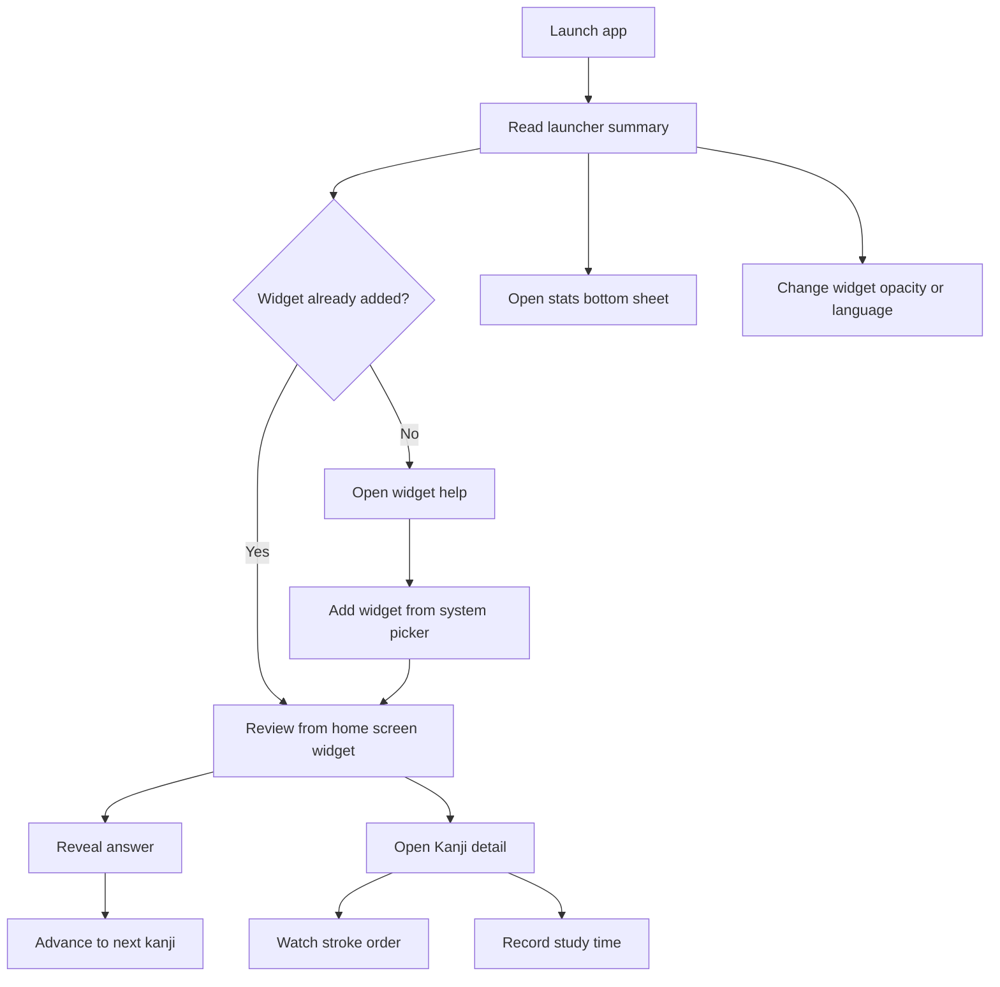

# Basic Design

## Overview

Kanji Widget is an Android app built around a home screen widget for lightweight Kanji review.

The product combines:
- a resizable home screen widget for quick reveal-and-next review
- a Kanji detail screen with stroke-order playback
- local daily study-time tracking based on detail-screen foreground time
- a lightweight launcher screen that summarizes activity and reopens the latest studied Kanji
- a compact study-stats surface with 7-day and 30-day charts
- an adaptive launcher icon built around a Kanji card motif

The app is widget-first.
The launcher and detail surfaces support the widget learning flow rather than replace it.

## Product Goals

Primary goals:
- let the user review Kanji quickly without opening a full app flow
- make it easy to jump from quick review into richer Kanji detail
- give the user lightweight feedback about recent study activity
- keep the product simple enough for fast, frequent use

Non-goals for the first version:
- account systems
- cloud sync
- social or comparative analytics
- a full study curriculum or deck-management system

## Target Users

The product is aimed at:
- learners who want low-friction Kanji exposure throughout the day
- users who prefer home screen widgets over opening a full app every time
- casual self-learners who benefit from simple review loops and visible progress

The product is not optimized in v1 for:
- structured classroom workflows
- advanced spaced-repetition customization
- multi-device learning continuity

## Core Use Cases

### 1. Quick review from the home screen

The user adds the widget, sees a Kanji, tries to recall the reading and meaning, reveals the answer, then advances to another Kanji.

### 2. Open richer Kanji detail

The user taps the widget card or launcher action to open the detail screen and inspect:
- Onyomi
- Kunyomi
- meaning
- note or example
- stroke-order playback
- a next-random continuation action

### 3. Check today’s study activity

The user opens the app from the launcher and sees:
- total study time today
- valid detail-screen opens today
- widget installation status
- the most recently viewed Kanji if available

### 4. Review short-term study trend

The user opens the stats surface from the launcher and switches between:
- last 7 days
- last 30 days

## Product Structure

### Home screen widget

The widget is the primary learning surface.

Key behavior:
- show the current Kanji or a loading placeholder
- reveal reading and meaning on the first action tap
- advance to another random Kanji on the next tap
- adapt visible content based on widget size
- adapt accent surfaces based on widget state such as loading, hidden-answer, and revealed-answer
- support a user-controlled background opacity level
- open the detail screen when the widget body is tapped

### Kanji detail screen

The detail screen is the richer study surface.

Key behavior:
- display the selected Kanji prominently
- show reading, meaning, JLPT level, note, and source
- load stroke-order playback data
- show today-only study statistics for the current Kanji
- let the user continue to another random kanji from the same screen
- record foreground viewing time for study tracking

### Main screen

The launcher screen is a lightweight summary and navigation surface.

Key behavior:
- summarize today’s study activity
- indicate whether at least one widget instance is installed
- reopen the most recently viewed Kanji when available
- provide access to the stats bottom sheet
- provide a simple global widget-opacity control
- provide widget setup guidance when appropriate

### Study stats surface

The stats surface is a bottom sheet launched from the main screen.

Key behavior:
- show charted daily study totals
- support 7-day and 30-day ranges
- show total and average study time for the selected range
- show the best day in the selected range
- hide latest-Kanji rows when no recent history exists

## Main User Flow

1. User installs and launches the app.
2. User adds the widget from the Android widget picker.
3. User reviews Kanji from the home screen widget.
4. User opens the detail screen from the widget when they want more context.
5. The app records local study-time metrics while the detail screen is visible.
6. The user later opens the launcher screen to review today’s summary and short-term trends.

### Flow Diagram

## UX Principles

The UX should emphasize:
- fast access: the first meaningful interaction should happen from the widget
- low friction: minimal setup and no required account flow
- clarity: reveal/next behavior should always be obvious
- graceful degradation: cached content should still be useful when network fetch fails
- lightweight motivation: stats should inform and encourage without becoming a heavy dashboard

## Data and Content Sources

Primary content sources:
- Kanji catalog and detail data from `kanjiapi.dev`
- stroke-order SVG data based on KanjiVG

Primary local storage:
- widget state and cached Kanji entries in `SharedPreferences`
- study-time metrics in `SharedPreferences`
- latest viewed Kanji history in `SharedPreferences`

## Visual Direction

The product should feel:
- calm and lightweight rather than game-like
- readable at a glance from the home screen
- utility-first, with emphasis on typography and hierarchy over dense controls

UI direction:
- large Kanji presentation
- strong separation between primary study content and metadata
- clear empty and loading states
- compact stats that do not compete visually with the learning flow
- widget surfaces should feel like layered study cards rather than plain stacked text
- the launcher icon should visually match the widget-first Kanji card identity

## Constraints

Technical and product constraints:
- the widget uses `RemoteViews`, so interaction and layout logic must stay simple
- network access is required for first-load remote Kanji data and stroke-order fetches
- the first version stores all study and widget data locally on device
- the app should remain usable even when only part of the data is cached
- widget appearance controls should prefer a few safe presets over freeform styling when `RemoteViews` host compatibility is uncertain

## Acceptance Criteria

The first version is successful if:
- a user can add the widget and complete the reveal-and-next learning loop
- tapping widget content opens a meaningful detail screen
- the detail screen records study time locally while it is visible
- the main screen summarizes today’s activity and provides widget help when needed
- the stats bottom sheet shows valid 7-day and 30-day local study totals
- the user can change widget background opacity from the app and see active widgets refresh accordingly
