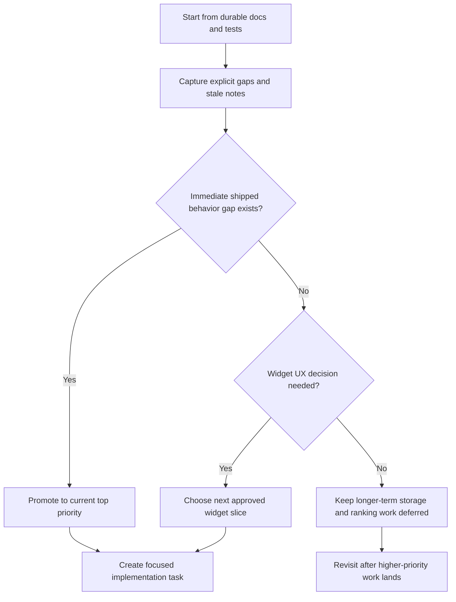

# Technical Backlog Triage Checklist

Last updated: 2026-03-12
Status: Proposed
Working branch: `master`
Base branch: `master`
Expected merge target: `master`

## Purpose

Capture the current short-list technical backlog for `kanji-widget` so later sessions can start from the highest-value follow-up work instead of re-triaging the same signals from code and docs.

This checklist is intentionally narrow. It does not try to replace product planning or act as a full roadmap.

## Current Priority Order

- Priority 1: align cached compound loading with the shipped Kanji Detail behavior for blank readings
- Priority 2: choose the next widget UX slice with the best value-to-complexity ratio
- Priority 3: review longer-term data-retention and ranking extensions after the current behavior gaps are closed

## Triage Flow

## Phase 1: Evidence Capture

- [x] Review current durable project context and repository docs for explicit future-work notes
- [x] Check the current test surface to identify obvious coverage gaps
- [x] Record the short-list backlog items with direct source references

## Priority 1: Test Coverage Expansion

- [x] Add focused tests for widget random selection avoiding immediate repeats
- [x] Add focused tests for widget size-class resolution and footer meta formatting
- [x] Add focused tests for per-widget preference read/write and cleanup on widget deletion

Evidence:
- `docs/detail-design/widget.md:440`
- `docs/detail-design/widget.md:441`
- `docs/detail-design/widget.md:442`
- `docs/detail-design/widget.md:443`
- `docs/detail-design/widget.md:444`
- `docs/detail-design/widget.md:445`
- Widget logic coverage was added on `2026-03-12` in PR `#3`

## Priority 1: Compound Cache Behavior Gap

- [x] Stop dropping cached compound rows only because the reading is blank
- [x] Add or update narrow tests for the cached-compounds read path so it matches the shipped Kanji Detail fallback behavior
- [x] Re-check Kanji Detail with cached compound data after the fix lands

Evidence:
- `app/src/main/java/com/example/kanjiwidget/widget/KanjiWidgetPrefs.kt:157`
- Shipped Kanji Detail behavior now keeps supported compound rows visible when readings are missing

## Priority 2: Docs Consistency Cleanup

- [x] Remove or rewrite stale main-screen future-work notes that no longer match shipped behavior
- [x] Re-scan the main design docs after that cleanup to ensure backlog notes still represent real open work

Evidence:
- `docs/detail-design/main-screen.md` previously listed expanding latest history to a bounded recent list as future work, but the feature is already shipped and the stale note has now been removed

## Priority 3: Next Widget UX Slice

- [ ] Decide whether the next widget slice should be `configuration activity` or `per-widget opacity`
- [ ] If approved, create a dedicated complex-task checklist from `docs/checklists/TEMPLATE-complex-task-checklist.md`
- [ ] Update the relevant widget design doc before implementation starts

Evidence:
- `docs/detail-design/widget.md:450`
- `docs/detail-design/widget.md:451`
- `docs/detail-design/widget.md:454`

## Deferred Backlog

- [ ] Review whether daily-study storage needs a retention or compaction policy before the local data footprint grows further
- [ ] Review whether ranking should later support per-kanji open-count metrics or custom time ranges

Evidence:
- `docs/detail-design/daily-study-time-tracking.md:232`
- `docs/detail-design/kanji-study-ranking.md:309`
- `docs/detail-design/kanji-study-ranking.md:310`
- `docs/detail-design/kanji-study-ranking.md:311`

## Acceptance Criteria

- [ ] Later sessions can identify the next highest-value technical task without redoing the same repository scan
- [ ] The backlog distinguishes immediate engineering debt from lower-priority future extensions
- [ ] The next implementation task can start from one clearly prioritized item instead of a broad vague roadmap

## Progress Log

- 2026-03-12: Reviewed current docs, active repository status, and test surface to extract the highest-value technical backlog items.
- 2026-03-12: Prioritized test coverage first because widget logic remains central to the app while current automated coverage is concentrated in detail and stats only.
- 2026-03-12: Recorded a stale docs item for main-screen future-work notes so a small cleanup task can keep backlog signals trustworthy.
- 2026-03-12: Removed the stale main-screen future-work note about bounded recent history and re-checked the remaining design-doc future-work sections for obviously shipped items.
- 2026-03-12: Completed the widget test coverage slice in PR `#3`, so that backlog item is no longer the next immediate priority.
- 2026-03-12: Recorded a remaining behavior gap in cached compound loading: blank readings are still filtered out by `KanjiWidgetPrefs.getCachedCompounds(...)`, which can diverge from the shipped Kanji Detail behavior after cache reuse.
- 2026-03-13: Aligned cached compound filtering with shipped Kanji Detail behavior so rows with blank readings remain visible when written and meaning are present.
- 2026-03-13: Added narrow unit coverage for the cached compound normalization path to keep the blank-reading fallback behavior from regressing.
