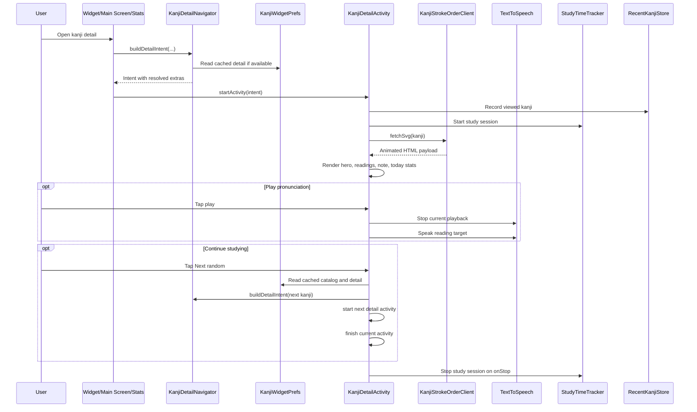

# Kanji Detail

## Purpose

Define the detailed design for the Kanji Detail screen.

This document covers:
- current screen structure
- stroke-order playback behavior
- detail navigation inputs
- today-only study metrics
- the Next random kanji action
- the first compound-examples slice for practical vocabulary context
- the first pronunciation-audio slice using Android `TextToSpeech`

## Scope

In scope:
- the `KanjiDetailActivity` screen structure and behavior
- detail-screen entry points from widget, main screen, and study stats
- cached metadata usage for detail rendering
- stroke-order loading and replay behavior
- next-random navigation from the detail screen
- a lightweight compounds section for the current kanji using one remote source and local cache support
- pronunciation playback for the main reading target and eligible compound rows using on-device `TextToSpeech`

Out of scope for the current version:
- editing or favoriting kanji
- server-backed progress sync
- spaced-repetition scheduling
- prefetching the next random kanji in the background
- full dictionary browsing or long-form example sentences from a second provider
- remote audio hosting or downloadable voice assets

## Current Components

Primary files:
- `app/src/main/java/com/example/kanjiwidget/KanjiDetailActivity.kt`
- `app/src/main/java/com/example/kanjiwidget/KanjiDetailNavigator.kt`
- `app/src/main/java/com/example/kanjiwidget/widget/KanjiStrokeOrderClient.kt`
- `app/src/main/res/layout/activity_kanji_detail.xml`

Supporting sources:
- `app/src/main/java/com/example/kanjiwidget/widget/KanjiWidgetPrefs.kt`
- `app/src/main/java/com/example/kanjiwidget/history/RecentKanjiStore.kt`
- `app/src/main/java/com/example/kanjiwidget/stats/StudyTimeTracker.kt`

## Screen Role

The Kanji Detail screen is the richer study surface opened from lightweight review entry points.

It should let the user:
- inspect one selected kanji in more detail
- replay stroke order on demand
- review readings, meaning, note, source, and available metadata
- review a few practical compound examples for the current kanji
- hear pronunciation playback for the main reading and supported compound readings
- see today-only study totals for the current kanji context
- continue to another random kanji without returning to the launcher

## UI Behavior

### V2 first-slice visual contract

This first slice is a layout and hierarchy refresh, not a feature expansion.

Approved first-slice direction:
- keep the screen as one lightweight study surface
- strengthen the hero so kanji and meaning remain dominant
- make `Next random` the clearer continuation action while keeping `Replay` visible
- make Onyomi, Kunyomi, and the main audio action read as one study block
- keep compounds lightweight but easier to scan when multiple rows are visible
- make today stats feel secondary and supportive instead of competing with the main study content
- avoid abrupt empty gaps when metadata, readings, compounds, or stroke-order content are unavailable

Out-of-scope for this slice:
- adding a new remote data provider
- turning the screen into a second dictionary-style browsing mode
- adding favorites, editable notes, or account-backed study state
- changing the underlying navigation or study-tracking contract

### Hero section

Current contents:
- large kanji title
- meaning subtitle
- optional hero metadata row
- JLPT badge

Hero metadata currently includes:
- stroke count
- grade
- frequency

Behavior:
- hide the hero metadata row when all three values are missing
- show the JLPT placeholder badge when JLPT data is unavailable

V2 first-slice direction:
- the hero should read as a study card with stronger visual separation between dominant study content and supporting metadata
- the JLPT badge should remain visible but secondary to the kanji and meaning
- metadata should stay scannable without competing with the main study target

### Stroke-order card

Current contents:
- card title and attribution
- short usage hint
- stroke-order canvas area
- status and loading state
- action row

Current action row:
- `Replay`
- `Next random`

Behavior:
- `Replay` restarts the current animation if stroke-order HTML is already loaded
- if the stroke-order payload is not loaded yet, `Replay` triggers a load attempt instead
- `Next random` opens another kanji detail screen and finishes the current detail activity

V2 first-slice direction:
- `Next random` should become the visually primary continuation action
- `Replay` should stay immediately available as a secondary action
- the action layout should remain comfortable on common phone widths without making the row feel crowded
- loading and error states should still occupy the canvas area without leaving broken transitions around the action area

### Readings section

Current contents:
- Onyomi label and value
- Kunyomi label and value
- one main pronunciation playback control

Behavior:
- use a shared placeholder when a reading field is unavailable
- treat placeholder-style values such as `-` as unavailable reading data
- for v1, the main playback target prefers `onyomi` and falls back to `kunyomi`
- hide or disable the playback control when neither reading is usable
- if a new playback starts, stop the previous playback first

V2 first-slice direction:
- the section should present Onyomi, Kunyomi, and the main playback control as one coherent study block
- a missing reading should keep the section stable instead of making the layout feel broken or lopsided
- the main playback control should remain easy to find without overpowering the text values

### Compound examples section

Current first-slice goal:
- show a compact list of up to 5 compounds related to the current kanji

Each visible compound row should include:
- written form
- reading
- short meaning
- short usage hint
- a small pronunciation playback control when the row has a usable reading

Behavior:
- keep the row visible when written form and meaning are usable, even if the reading is missing
- use the shared unavailable-reading placeholder when the row reading is blank

Current behavior target:
- prefer compounds that appear common or readable based on source priority metadata
- avoid unusually long, low-signal, or obviously obscure rows when better candidates exist
- hide the entire section if no suitable compounds are available after filtering

Usage hint rule for v1:
- the usage field is a short label derived from source priority markers and meaning shape
- it is not a generated full sentence example
- example labels may include `Common word`, `News-heavy`, `Formal term`, or `Study word`

Compound audio rule for v1:
- compound-row playback uses the row reading returned from the compounds source
- hide or disable the row playback control when the row reading is blank
- starting compound playback should stop any current main-reading or compound playback first

V2 first-slice direction:
- each compound row should feel easier to scan when several rows are visible in sequence
- written form, reading, meaning, and usage hint should keep a clear visual hierarchy
- playback affordances should remain visible but lightweight
- when the app locale is Vietnamese, compound meanings should prefer a cached Vietnamese localized meaning and fall back gracefully to the source meaning until the localized cache is ready

### Today section

Current contents:
- Today total
- Valid opens
- This kanji

Behavior:
- values are computed from local study tracking only
- the section always renders, even when the values are zero

V2 first-slice direction:
- today stats should feel like supportive context rather than a second primary content block
- the three values should be easy to compare at a glance without taking more visual weight than the hero, stroke-order, or readings sections

### Meaning and note sections

Current contents:
- primary meaning
- note or example text
- source line

Behavior:
- meaning and note each fall back to their own placeholder copy when no cached detail is available
- the source line always renders and falls back to the default source label when a specific source is unavailable

V2 first-slice direction:
- meaning should remain easy to scan after the hero and readings sections without creating a jarring jump in emphasis
- note and source should remain readable but secondary
- fallback text should still look intentional when detail cache is partial

## Navigation Inputs

The detail screen accepts explicit extras for:
- kanji
- source
- JLPT level
- Onyomi
- Kunyomi
- meaning
- note
- stroke count
- grade
- frequency

Current shared builder:
- `KanjiDetailNavigator.buildDetailIntent(...)`

Current entry points:
- widget card tap
- main screen latest-kanji action
- main screen random-kanji action
- recent-kanji rows on the main screen
- kanji ranking rows in the study stats bottom sheet
- detail-screen `Next random` action

## Data Flow

### Detail content

Current behavior:
1. An entry point builds a detail intent through `KanjiDetailNavigator`
2. The navigator reads cached kanji detail from `KanjiWidgetPrefs` when available
3. Cached values override fallback values from the calling surface
4. `KanjiDetailActivity` renders the received extras directly

Reason:
- keeps the detail-screen contract stable across multiple launch surfaces
- avoids duplicating detail-intent assembly logic in each caller

### Localized meaning behavior

For the Vietnamese-meaning first slice:
- keep the raw source meaning separate from the Vietnamese localized meaning cache
- resolve display meaning through one locale-aware formatter instead of binding directly to the raw cache field
- if a cached entry only has the source meaning, the detail screen may render fallback content first and then refresh after the Vietnamese localized cache is written

## Main Interaction Diagram

### Stroke-order loading

Current behavior:
1. `KanjiDetailActivity` starts a load when a non-empty kanji is present
2. `KanjiStrokeOrderClient.fetchSvg(...)` loads the SVG
3. `KanjiStrokeOrderClient.buildAnimatedHtml(...)` converts the SVG to animated HTML
4. the screen loads the HTML into a `WebView`

### Study tracking

Current behavior:
- on `onStart`, the screen records the viewed kanji in `RecentKanjiStore`
- on `onStart`, the screen starts a study session through `StudyTimeTracker`
- on `onStop`, the screen stops the current study session
- today metrics are refreshed from local study totals

### Audio playback

Current v1 behavior:
1. `KanjiDetailActivity` initializes an on-device `TextToSpeech` helper
2. The helper attempts to use Japanese voice data when available
3. If initialization or language setup fails, audio controls stay unavailable without blocking the rest of the screen
4. A new play action stops any current playback before speaking the new target
5. Activity teardown stops playback and releases `TextToSpeech`
6. Placeholder-style or sentinel reading values should not be treated as playable targets

## Random Navigation Behavior

The detail screen supports one-tap continuation to another random kanji.

Current behavior:
- use the cached kanji catalog from `KanjiWidgetPrefs`
- when the catalog has more than one item, avoid choosing the current kanji if possible
- build the next detail intent through `KanjiDetailNavigator`
- rely on cached detail extras when available for the selected kanji
- call `startActivity(...)` for the next detail screen
- immediately call `finish()` on the current detail activity

Reason:
- preserves a lightweight review flow from inside the detail screen
- avoids building a long stack of detail activities

### Disabled state

If the cached catalog is unavailable:
- disable the `Next random` button
- reduce its alpha
- keep the label unchanged

Reason:
- the action should remain visually consistent without failing silently after a tap

## Storage And API Impact

Current local dependencies:
- cached kanji catalog from `KanjiWidgetPrefs`
- cached per-kanji detail entries from `KanjiWidgetPrefs`
- recent-view history from `RecentKanjiStore`
- local study stats from `StudyTimeTracker`
- cached per-kanji compound entries from local preferences if the first compounds fetch has already completed
- Android `TextToSpeech` state owned by the current detail activity

Current remote dependency:
- KanjiVG-derived stroke-order SVG loading through `KanjiStrokeOrderClient`
- `kanjiapi.dev` word lookup for compound examples

Current compounds caching rule:
- cache filtered compound results locally for the current kanji
- refresh when the compounds cache is missing or older than the approved freshness window
- keep this cache independent from stroke-order loading so a failed compounds fetch does not block the rest of the detail screen

## Edge Cases

### Missing kanji extra

Behavior:
- render placeholder hero content
- render empty study info placeholders
- show the empty-state error message
- do not attempt to start a valid study session

### Missing metadata

Behavior:
- hide the hero metadata row if stroke count, grade, and frequency are all absent
- keep the rest of the screen visible

### Missing cached detail fields

Behavior:
- render placeholders for readings, meaning, and note
- render the default source label

### Unavailable text-to-speech support

Behavior:
- if Japanese `TextToSpeech` support is unavailable or initialization fails, keep the rest of the detail screen fully usable
- hide or disable audio controls in a stable way rather than leaving them tappable and failing silently

### Missing or weak compounds data

Behavior:
- if the remote source returns no suitable compound rows after filtering, hide the compounds section
- if the source is temporarily unavailable and no fresh cache exists, keep the rest of the screen fully usable
- if a fresh enough compounds cache exists, prefer showing cached rows over blocking on a new fetch

### Stroke-order load failure

Behavior:
- hide the loading indicator
- show an explicit error message for the current kanji
- keep the replay action enabled so the user can retry

### Empty catalog for Next random

Behavior:
- disable the action
- reduce button alpha
- do not attempt random navigation

## Testing Notes

Recommended checks:
- open detail from widget, main screen, and stats ranking rows
- verify cached meaning, JLPT, and metadata appear when available
- verify placeholders render when cached detail is absent
- verify compounds appear for a kanji with strong source matches
- verify the compounds section hides when no suitable rows remain after filtering
- verify cached compounds are reused on reopen inside the approved freshness window
- verify the main reading audio prefers `onyomi` and falls back to `kunyomi`
- verify compound row audio plays the row reading when supported
- verify unavailable TTS support leaves the rest of the screen usable
- verify stroke-order loading, replay, and retry-after-failure behavior
- verify `Next random` avoids the current kanji when the catalog has multiple entries
- verify `Next random` is disabled when the catalog is unavailable
- verify the current detail screen finishes after opening the next random kanji
