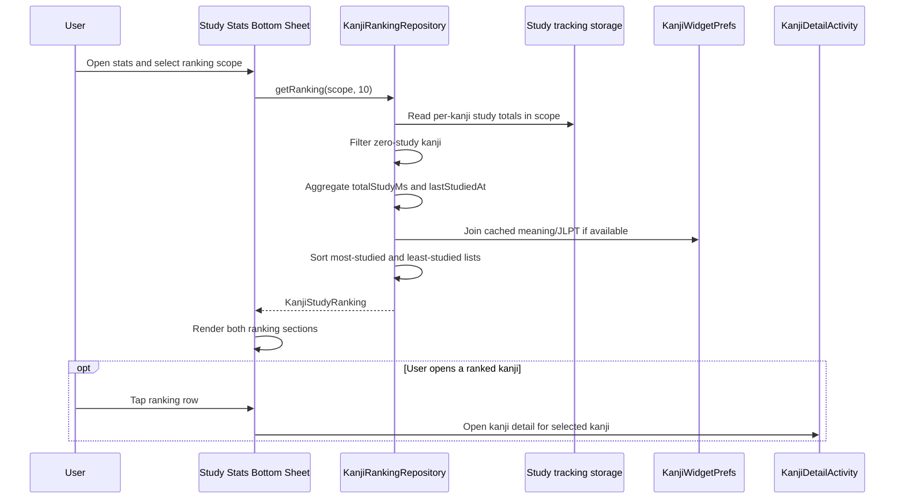

# Kanji Study Ranking

## Purpose

Define the detailed design for ranking kanji by how much the user has studied them.

This feature adds two ranking views:
- top 10 kanji studied the most
- top 10 kanji studied the least among kanji that have been studied at least once

The feature is intended to sit alongside the current study statistics experience.

## Scope

In scope:
- aggregate study-time data by kanji
- exclude kanji with no recorded study time
- support ranking by highest and lowest total study time
- show up to 10 items in each list
- integrate ranking into the current launcher statistics surface

Out of scope for the first version:
- cloud-backed ranking
- ranking by custom user-defined tags or lists
- ranking by spaced-repetition state
- ranking for kanji that have never been studied

## User Value

This feature helps the user:
- identify which kanji received the most attention
- discover which studied kanji received the least attention
- reflect on where time is concentrated
- reopen ranked kanji quickly for follow-up study

## Metric Definition

### Ranking metric

The default ranking metric is:
- total recorded study time per kanji

Source:
- accumulated foreground time tracked by `StudyTimeTracker`

Included entries:
- only kanji with `totalStudyMs > 0`

Excluded entries:
- kanji with no tracked study time
- kanji that exist in the remote catalog but have never been studied

### Tie-break rules

For `most studied` ranking:
- sort by `totalStudyMs` descending
- then by `lastStudiedAt` descending
- then by kanji codepoint string ascending

For `least studied` ranking:
- sort by `totalStudyMs` ascending
- then by `lastStudiedAt` ascending
- then by kanji codepoint string ascending

Reason:
- ranking must remain stable even when multiple kanji have identical study time

## Supported Scopes

Recommended v1 scopes:
- `ALL_TIME`
- `LAST_30_DAYS`

Default scope:
- `ALL_TIME`

Reason:
- all-time ranking is easy to understand
- 30-day ranking gives a more recent view and avoids older activity dominating forever

## UI Behavior

### Placement

Recommended first integration:
- place the ranking below the chart summary inside the existing study-stats bottom sheet

Reason:
- the ranking is clearly part of the study-stats feature set
- this avoids creating a separate ranking screen too early

### Sections

The UI should show:
- `Học nhiều nhất`
- `Học ít nhất`

Each section should contain:
- up to 10 rows
- a small section title
- an empty-state message if no ranking data is available

### Scope selector

The ranking should use its own simple scope selector.

Current recommendation:
- show `All time` and `30 ngày` as explicit ranking scopes
- keep the ranking selector visually close to the ranking sections

Reason:
- ranking needs an all-time view that does not exist in the current chart selector
- decoupling ranking scope from chart scope avoids confusing mappings between `7 ngày` and all-time behavior

## Row Design

Each ranking row should include:
- kanji
- short metadata such as meaning or JLPT level if available
- total study time

Optional supporting field:
- relative last studied time

Interaction:
- tapping a row opens `KanjiDetailActivity` for that kanji

## Data Flow

1. UI requests ranking data for a selected scope
2. Ranking repository reads study records grouped by kanji
3. Repository filters out kanji with zero total study time
4. Repository aggregates:
   - total study time
   - latest studied timestamp
5. Repository joins cached kanji metadata if available
6. Repository sorts and returns:
   - top 10 most studied
   - top 10 least studied among already studied kanji

## Main Interaction Diagram



## Storage Design

### Current source data

The feature uses existing study-tracking data.

Current per-kanji key format:
- `study_kanji_YYYY-MM-DD_<kanji>`

Current daily open-count key:
- `study_open_count_YYYY-MM-DD`

Important constraint:
- `StudyTimeTracker` currently stores open count per day, not per kanji

Design implication:
- v1 ranking can always compute `totalStudyMs`
- per-kanji `openCount` cannot be derived correctly from the current public storage contract

V1 contract decision:
- omit `openCount` from ranking rows
- use only `totalStudyMs` and `lastStudiedAt` for ranking and display
- consider per-kanji open-count storage only in a future extension

## Repository Design

Suggested file:
- `app/src/main/java/com/example/kanjiwidget/stats/KanjiRankingRepository.kt`

Responsibilities:
- scan tracked kanji study data
- aggregate totals by kanji
- filter out zero-study items
- sort into top and bottom rankings
- enrich rows with cached metadata when available

Suggested models:

```kotlin
data class KanjiStudyRankItem(
    val kanji: String,
    val totalStudyMs: Long,
    val lastStudiedAt: Long?,
    val meaning: String?,
    val jlptLevel: String?,
)

data class KanjiStudyRanking(
    val scope: RankingScope,
    val mostStudied: List<KanjiStudyRankItem>,
    val leastStudied: List<KanjiStudyRankItem>,
)

enum class RankingScope {
    ALL_TIME,
    LAST_30_DAYS,
}
```

Suggested API:

```kotlin
class KanjiRankingRepository(private val context: Context) {
    fun getRanking(scope: RankingScope, limit: Int = 10): KanjiStudyRanking
}
```

Rules:
- `limit` must be positive
- returned lists may contain fewer than 10 items if not enough studied kanji exist
- `leastStudied` must never include kanji with zero study time

## Metadata Joining

The ranking may enrich entries using cached metadata from widget storage.

Possible source:
- `KanjiWidgetPrefs.getRemoteEntry(kanji)`

Joined fields:
- meaning
- JLPT level

Fallback rule:
- if metadata is unavailable, still show the kanji and study-time metric

## Empty State Design

If no kanji has recorded study time in the selected scope:
- hide ranking rows
- show text such as `Chưa có đủ dữ liệu học để tạo xếp hạng`

If only a few kanji have been studied:
- show only the available rows
- do not add placeholder rows

## Edge Cases

### No metadata cache

If study data exists but cached kanji metadata does not:
- ranking still works
- rows show kanji and numeric study metrics only

### Very small totals

If multiple kanji have only a few seconds of study time:
- include them if they are above zero
- tie-break rules still apply

### Same kanji across multiple days

If the same kanji appears on multiple dates:
- aggregate all matching records inside the selected scope

### Scope with sparse data

If `LAST_30_DAYS` contains very few studied kanji:
- show only matching items
- do not mix in older all-time data

### Storage growth

If historical tracking data becomes large:
- first version may still scan local keys directly
- future versions may need an aggregate cache

## Technical Notes

### Performance

For v1:
- direct aggregation from `SharedPreferences` keys is acceptable if data volume remains small

Future improvement:
- maintain rolling aggregate keys for faster ranking reads

### Ownership

`StudyTimeTracker` remains the owner of raw study-time storage.

V1 contract decision:
- `KanjiRankingRepository` scans documented study-tracking storage keys directly
- this is acceptable because per-kanji aggregation is not exposed through public tracker APIs today

Required documentation rule:
- the key pattern `study_kanji_YYYY-MM-DD_<kanji>` is now a shared stats-layer storage contract for ranking reads
- if `StudyTimeTracker` storage changes later, ranking logic must be updated in the same change

## Testing Notes

Manual test cases:
- study several kanji with different durations and verify `most studied` ordering
- verify `least studied` excludes kanji with zero study time
- verify fewer than 10 studied kanji produces a shorter list
- verify tapping a ranked row opens the correct detail screen
- verify `LAST_30_DAYS` excludes older activity

Suggested unit tests:
- aggregation by kanji across multiple dates
- filtering of zero-study kanji
- sorting and tie-break rules
- scope filtering
- limit handling

## Future Extensions

Potential future improvements:
- add per-kanji open-count storage for richer row metrics
- rank by open count in addition to study time
- support ranking by custom time ranges
- expose ranking on a dedicated statistics screen if the stats feature set grows
