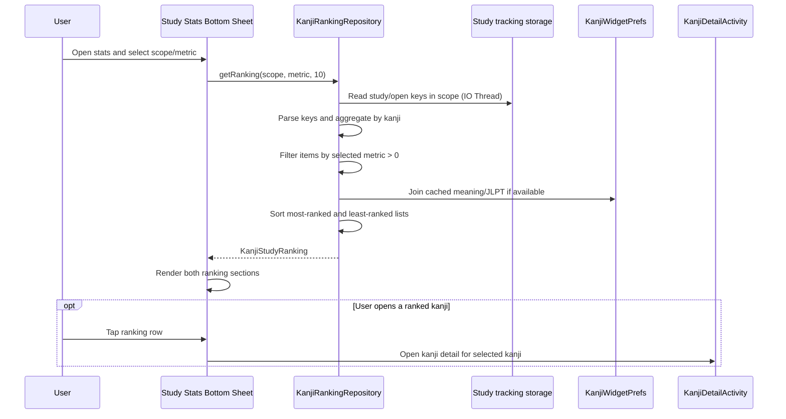

# Kanji Study Ranking

## Purpose

Define the detailed design for ranking kanji by how much the user has studied them or engaged with them.

This feature provides insights into:
- top 10 kanji studied the most (by duration)
- top 10 kanji engaged the most (by open count)
- top 10 kanji studied the least among studied kanji

The feature sits alongside the current study statistics experience.

## Scope

In scope:
- aggregate study-time data and open-count data by kanji
- exclude kanji with no recorded activity
- support ranking by highest and lowest totals
- show up to 10 items in each list
- allow toggling between "Study Time" and "Open Count" metrics
- integrate ranking into the current launcher statistics surface

Out of scope:
- cloud-backed ranking
- ranking by spaced-repetition state
- ranking for kanji that have never been studied or opened

## User Value

This feature helps the user:
- identify which kanji received the most attention (time)
- discover which kanji they are most curious about (opens)
- reflect on where time and focus are concentrated
- reopen ranked kanji quickly for follow-up study

## Metric Definitions

### 1. Study Time Metric (Default)

- **Definition:** Total accumulated foreground time per kanji.
- **Source:** `study_kanji_YYYY-MM-DD_<kanji>` keys in `SharedPreferences`.
- **Value:** `Long` (milliseconds).

### 2. Open Count Metric

- **Definition:** Total number of times a kanji detail screen was opened.
- **Source:** `study_open_kanji_YYYY-MM-DD_<kanji>` keys in `SharedPreferences`.
- **Value:** `Long` (count).
- **Trigger:** Recorded once per unique activity session in `KanjiDetailActivity` (avoiding duplicates on rotation).

### Tie-break rules

For `most` ranking:
- sort by primary metric descending
- then by `lastActivityAt` descending
- then by kanji codepoint string ascending

For `least` ranking:
- sort by primary metric ascending
- then by `lastActivityAt` ascending
- then by kanji codepoint string ascending

## Supported Scopes

Recommended scopes:
- `ALL_TIME`
- `LAST_30_DAYS`
- `LAST_7_DAYS` (New)

Reason:
- 7-day ranking provides a high-frequency view of immediate focus.

## UI Behavior

### Placement

- Place the ranking below the chart summary inside the `StudyStatsBottomSheet`.

### Metric Toggle

- Use a small `SegmentedButton` or `TabLayout` to switch between **Time** and **Opens**.
- Updating the metric should refresh the lists with a subtle transition.

### Sections

- `Học nhiều nhất` / `Xem nhiều nhất` (based on toggle)
- `Học ít nhất` / `Xem ít nhất`

## Data Flow

1. UI requests ranking data for a selected scope and **metric**.
2. Ranking repository performs a single scan of `SharedPreferences` on `Dispatchers.IO`.
3. Repository uses Regex `study_(kanji|open_kanji)_([0-9]{4}-[0-9]{2}-[0-9]{2})_(.+)` to parse keys.
4. Repository aggregates both `totalStudyMs` and `totalOpenCount` into a per-kanji model.
5. Repository joins cached kanji metadata.
6. Repository returns sorted `KanjiStudyRanking` object.

## Main Interaction Diagram



## Repository Design

Suggested models:

```kotlin
data class KanjiStudyRankItem(
    val kanji: String,
    val totalStudyMs: Long,
    val openCount: Long,
    val lastActivityAt: Long?,
    val meaning: String?,
    val jlptLevel: String?,
)

enum class RankingMetric {
    STUDY_TIME,
    OPEN_COUNT,
}

data class KanjiStudyRanking(
    val scope: RankingScope,
    val metric: RankingMetric,
    val mostRanked: List<KanjiStudyRankItem>,
    val leastRanked: List<KanjiStudyRankItem>,
)
```

## Storage Constraints & Technical Debt

### Performance Rule
- All ranking scans **MUST** run on a background thread.
- Direct `SharedPreferences` scanning is acceptable for v1 but is marked as technical debt for datasets exceeding 10,000 keys.

### Key Naming
- Study time: `study_kanji_YYYY-MM-DD_<kanji>`
- Open count: `study_open_kanji_YYYY-MM-DD_<kanji>`

## Future Extensions

- Add custom date range picker for ranking.
- Migrate storage to SQLite/Room if key proliferation causes startup performance regression.
- Add "Mastery Level" metric based on quiz/test results.
