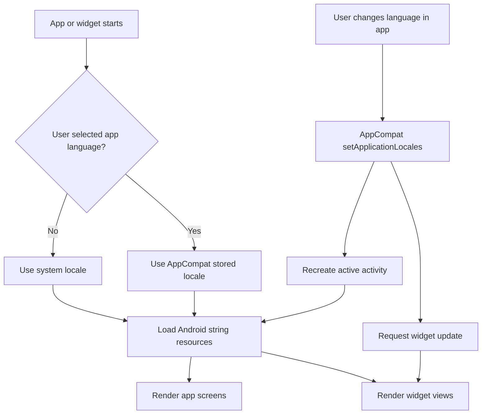

# Localization And Language Support

Last updated: 2026-03-13

## Goals

- Support English (EN) and Vietnamese (VI) across the app and widget.
- Allow future language expansion without refactoring UI logic.
- Provide an in-app language selector while still honoring system locale by default.
- Keep widget-first UX readable and concise across locales.

## Non-Goals (Current Scope)

- Translating readings or compound-example text into additional languages.
- Automatic translation of user-generated note content.
- Replacing the current kanji content provider with a multilingual dictionary source in the same slice.

## Locale Strategy

- Default resource locale: English in `res/values/`.
- Vietnamese translations in `res/values-vi/`.
- Future locales added via `values-xx/` folders and the same string keys.
- Use Android `plurals` for any quantity-sensitive strings.
- Use locale-aware formatting for dates/times and numeric units.

## External Content Localization

- UI strings continue to come from Android resources.
- Raw kanji meanings currently come from `kanjiapi.dev` and should be treated as source-language content, not pre-localized Vietnamese content.
- The first Vietnamese-meaning slice should preserve the source meaning separately from any localized Vietnamese meaning stored on device.
- When the app locale is Vietnamese, app surfaces should prefer the cached Vietnamese meaning when available.
- When the Vietnamese localized meaning is missing or not ready yet, the app may render the source meaning as a fallback and backfill the localized cache asynchronously.
- English mode should continue to render the source meaning directly.
- For compact gloss lists, prefer translating the normalized whole meaning phrase instead of isolated fragments so the Vietnamese result reads more naturally.

## In-App Language Selector

- Offer a language selector under Settings or the main screen entry.
- Persist the selection via AppCompat per-app language storage (no custom prefs required).
- Use AppCompat per-app language APIs where supported and fall back to system locale otherwise.
- When language changes, refresh widget content and key app surfaces.

## Locale Selection Flow

Implementation notes:
- Activities should use AppCompat so per-app language updates apply consistently.
- Maintain `res/xml/locales_config.xml` with supported locale tags.

## String Key Conventions

- Group keys by surface: `widget_*`, `home_*`, `detail_*`, `chart_*`, `ranking_*`, `settings_*`.
- Use explicit placeholder tokens `%1$s`, `%1$d`, etc. for formatting.
- For widget preview-only labels in layout XML, use `tools:text` rather than `android:text` to avoid hardcoded UI strings.

## Glossary (EN → VI)

- Widget → Widget
- Study card → Thẻ học
- Reveal answer → Mở đáp án
- Next kanji → Kanji khác
- Loading → Đang tải
- Stroke order → Thứ tự nét
- Reading → Cách đọc
- Onyomi → Onyomi
- Kunyomi → Kunyomi
- Meaning → Nghĩa
- Note → Ghi chú
- Today → Hôm nay
- Study time → Thời gian học
- Open count → Lượt mở hợp lệ
- Recent → Gần đây
- Continue → Tiếp tục
- Ranking → Xếp hạng
- Most studied → Học nhiều nhất
- Least studied → Học ít nhất
- Last studied → Học gần nhất
- Built-in → Có sẵn
- Source → Nguồn
- Updated → Cập nhật
- Minutes → phút
- Seconds → giây

## Open Questions

- Final placement of the language selector (Settings screen vs. main screen section).
- Whether to include Japanese (JA) in the first release or later.
