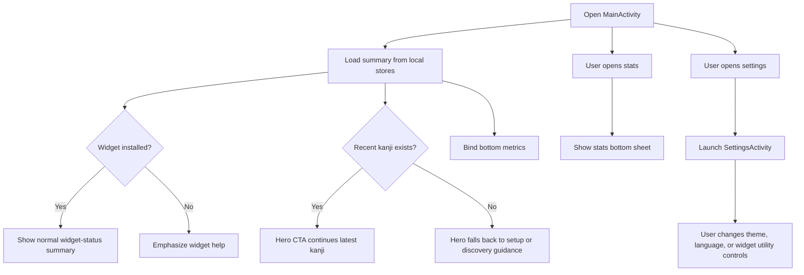

# Main Screen

## Purpose

Define the detailed design for the app main screen launched from the app icon.

This document covers:
- current behavior
- the current launcher design direction and its extension points

## Current State

Current implementation:
- `MainActivity` renders a lightweight launcher dashboard
- the app is still widget-first
- users are expected to interact mainly through the home screen widget and use the launcher as a summary or fallback surface

Current file:
- `app/src/main/java/com/example/kanjiwidget/MainActivity.kt`

## Design Goal

The main screen acts as a lightweight control center for the widget-based learning flow.

The screen should help users:
- understand what the app does
- install or use the widget
- continue learning from the latest kanji or a random kanji
- enter the roadmap when they want explicit stage guidance
- review today’s learning activity
- open a lightweight settings screen for non-study controls

## Scope

In scope:
- define the structure and behavior of the main screen
- align the screen with existing widget and detail-screen features
- allow future integration with daily study statistics

Out of scope for the first version:
- user accounts
- remote sync
- advanced charts beyond the current lightweight bottom-sheet experience
- heavy onboarding flow

## Screen Role

The main screen should act as:
- an entry point for users who open the app from the launcher
- a fallback surface when widget interaction is not enough
- a summary screen for today’s study usage

## Proposed UI Structure

### 1. Hero Summary

The refreshed main screen now uses one stronger hero block that owns the next study action and the only settings entry affordance.

Contents:
- dynamic hero label
- one large continuation title
- short one-line description
- two compact metadata pills
- one dominant primary CTA
- two secondary action chips for random review and study stats
- one compact settings icon aligned to the hero top row

Purpose:
- make the next learning action feel obvious immediately
- keep secondary actions nearby without creating a second full study card
- keep the launcher visually aligned with the approved first-slice demo direction

Behavior:
- the dominant CTA should represent the best next learning step for the current state
- if recent history exists, the primary CTA should continue the latest Kanji
- if recent history is missing, the hero should fall back to setup or discovery guidance instead of showing a dead primary action
- the hero metadata should prioritize recent-context signals such as relative open time, JLPT level, widget status, and readiness state instead of repeating long status copy

### 2. Hero Secondary Actions

Contents:
- `Random review`
- `Study stats`

Purpose:
- keep secondary study actions accessible without competing with the hero CTA

Behavior:
- these actions should stay inside the hero block instead of living in a second standalone card
- random-kanji action uses the cached catalog and avoids the latest kanji when possible
- the stats action remains available from this section because it is a secondary exploration path

### 3. Recent Kanji Section

Contents:
- up to four recent kanji tiles
- each item opens the detail screen

Purpose:
- make the app usable as a lightweight review hub
- support quick re-entry into recent study history without competing with the hero CTA

First-slice direction:
- keep the bounded recent grid directly on the screen
- show each tile as a compact card with Kanji, meaning, and recent metadata
- avoid promoting the first recent item as a second primary action when the hero already owns that role

### 4. Settings Entry

Contents:
- one compact settings icon inside the hero block
- one quiet widget-status summary section lower on the screen

Purpose:
- keep the main screen focused on learning and summary content
- preserve access to utility controls without stacking multiple low-priority calls to action below the main study sections

First-slice direction:
- keep the top-bar settings entry compact and obvious
- keep the widget-status section informational rather than interactive
- expose only one launcher entry instead of a second settings CTA in the content area

Behavior:
- tapping the top-bar icon opens a dedicated `SettingsActivity`
- the main screen no longer directly hosts widget-opacity, theme, or language controls
- the settings screen becomes the home for widget utility actions and in-app appearance controls

### 5. Snapshot Metrics

Contents:
- one `Today` metric card
- one `Consistency` metric card

Purpose:
- keep lightweight daily momentum visible without opening the stats bottom sheet
- give the bottom of the screen a clean finish instead of ending on utility-only content

Behavior:
- the `Today` metric should show current valid opens for the day
- the `Consistency` metric should show the current streak in days
- both cards remain informational and should not compete with the hero CTA or stats action

### 6. Roadmap Entry

Contents:
- one dedicated roadmap summary card
- one primary action opening the roadmap surface
- two compact metadata pills for current and next stage context

Purpose:
- expose the new JLPT-first path without overloading the hero
- keep the roadmap discoverable from the launcher while preserving the launcher's lightweight role

Behavior:
- if roadmap data exists, show current stage progress and next-stage context
- if roadmap data is not ready yet, keep the card visible with a sync-first explanation
- tapping the primary action opens `RoadmapActivity`

## User Flow

### Flow A: First app launch

1. User taps app icon
2. Hero explains the widget-centric concept and shows setup-oriented guidance
3. Main screen emphasizes how to add the home screen widget
4. User returns to the launcher and adds the widget

### Flow D: Open settings

1. User opens app
2. User taps the top-bar settings icon
3. App opens `SettingsActivity`
4. User changes theme, language, widget opacity, or opens widget setup help from that screen

### Flow B: Returning user

1. User taps app icon
2. Hero shows recent-study context and the dominant next study action
3. User continues the latest kanji from the hero, or uses supporting actions for random study or stats

### Flow C: User without widget

1. User opens app
2. Main screen detects that no widget instance is currently active
3. Hero and widget-status copy emphasize setup help over deeper exploration

## Main Interaction Diagram

## Behavior Rules

### Current version

The main screen should:
- stay lightweight
- avoid replacing the widget as the main learning surface
- not duplicate all detail-screen functionality
- present one clearly dominant study CTA instead of repeating the same action across multiple equal sections

### Empty state

If there is no recorded study data:
- keep the summary visible but supportive
- show setup guidance for the widget
- let the hero frame the next step as onboarding-lite instead of a dead continuation flow

### With data

If study data exists:
- show recent context and quick metadata inside the hero first
- prioritize one-tap continuation through the hero CTA
- keep recent-history, widget-status, and snapshot-metric sections secondary in visual emphasis

### Settings entry rule

The launcher exposes one lightweight navigation point for settings-oriented controls.

Current behavior:
- the main screen no longer hosts dedicated cards for widget opacity, theme, or language
- one top-bar settings icon opens the dedicated settings screen
- the content-level widget-status section is informational only and must not compete with the top-bar settings action
- the settings screen holds the shared widget-opacity slider, visible theme selection, language picker, and widget-help action

Reason:
- the main screen stays aligned with its learning-hub role
- utility controls remain available without diluting the main study hierarchy

### Widget detection rule

The app should treat the widget as installed when at least one app widget instance exists for `KanjiAppWidgetProvider`.

Detection method:
- query `AppWidgetManager`
- resolve widget ids for `KanjiAppWidgetProvider`
- if the returned id list is not empty, widget-installed state is `true`
- otherwise widget-installed state is `false`

Behavior:
- if no widget instance exists, emphasize widget help content
- if at least one widget instance exists, show the normal launcher summary layout

## Navigation Design

Suggested destinations from the main screen:
- detail screen for the most recently viewed kanji
- a lightweight stats bottom sheet
- dedicated settings screen for theme, language, and widget utility controls

Navigation style:
- simple explicit buttons or cards
- no bottom navigation is needed

## Data Dependencies

Required local data:
- daily total study time
- daily open count
- current streak days
- latest viewed kanji
- optional recent kanji list
- current shared widget background opacity value

Existing reusable source:
- `StudyTimeTracker` for today totals
- `StudyStatsRepository` for the current streak snapshot

Existing local storage:
- recent kanji history store
- widget appearance preferences

### Recent kanji history store

The main screen requires a concrete recency source.

Current local storage:
- `SharedPreferences`

Current responsibility:
- persist the latest opened kanji whenever `KanjiDetailActivity` starts
- keep enough data for the launcher to reopen the latest viewed Kanji

Current data:
- latest viewed kanji
- latest viewed timestamp
- bounded recent kanji list

Current keys:
- `latest_kanji`
- `latest_kanji_viewed_at`
- `recent_kanji_history_v2`

Current behavior:
- store the latest viewed kanji and timestamp for simple launcher access
- maintain a bounded recent list of the latest 10 unique kanji
- move a kanji to the top when it is opened again

### Widget appearance preferences

Current storage:
- `SharedPreferences` in the widget preference store

Current responsibility:
- persist one global widget background opacity value
- expose the current value to `MainActivity`
- let widget rendering read the same value when producing `RemoteViews`

## Technical Notes

Current implementation path:
- `MainActivity` is a layout-based activity
- summary fields are populated through a single repository-owned summary model
- keep business logic separate from the activity
- keep `MainActivity` focused on study and summary concerns while `SettingsActivity` owns utility controls

Primary files:
- `app/src/main/res/layout/activity_main.xml`
- `app/src/main/java/com/example/kanjiwidget/MainActivity.kt`
- `app/src/main/java/com/example/kanjiwidget/home/HomeSummaryRepository.kt`
- `app/src/main/java/com/example/kanjiwidget/history/RecentKanjiStore.kt`

### Data ownership

`HomeSummaryRepository` should be the single owner that assembles summary and recency data for the main screen.

Repository inputs:
- widget-installed state from `AppWidgetManager`
- today totals from `StudyTimeTracker`
- latest and recent kanji history from `RecentKanjiStore`
- cached kanji catalog from `KanjiWidgetPrefs` for the random-open action

Repository output:
- one main-screen summary model consumed by `MainActivity`

Current exception:
- widget appearance preferences such as global opacity are still read and written directly by `MainActivity`
- the random-kanji action currently reads the cached catalog directly from `KanjiWidgetPrefs`
- this is acceptable in v1 because the setting is small, local, and immediately followed by widget rerendering

Example summary fields:
- `isWidgetInstalled`
- `todayStudyMs`
- `todayOpenCount`
- `latestKanji`
- `latestViewedAt`
- `latestMeaning`
- `latestJlpt`
- `recentKanji`
- `showWidgetHelp`

### Study stats destination

The launcher stats action now has a concrete first-version target.

Current behavior:
- do not create a separate statistics screen
- open an in-app bottom sheet from the main screen
- support `7 ngày` and `30 ngày` chart ranges
- show chart summary values for the selected range
- show lightweight range insights including active study days and the current streak ending today
- show the latest opened kanji when available
- keep ranking inside the same bottom sheet

Fallback rule:
- if `latestKanji` is missing, hide that row in the stats bottom sheet
- keep chart and summary content available even when latest-history data is missing
- if the selected chart range has no study data, keep the sheet informative with empty-state summary copy instead of collapsing the content

Reasoning:
- this keeps the action useful
- it stays aligned with the current lightweight scope
- it avoids creating a full statistics screen too early
- it adds motivation-oriented feedback without turning the surface into a full analytics dashboard

## Edge Cases

### No widget installed

The app should still be usable and should explain how to add the widget.

### No tracked study data

The screen should not feel empty.
Use setup guidance and concise educational copy instead.

### No active widget instance

If the user changes opacity while no widget is active:
- keep the selected value
- apply it the next time a widget instance is added or refreshed

### Latest kanji missing

If recent-history data is unavailable:
- the hero should not present a broken continuation CTA
- supporting actions should still allow random study and stats access when valid
- keep summary and widget help visible

### Widget not installed but study data exists

If the user has study data but no current widget instance:
- still show today summary
- keep widget help visible near the bottom
- do not force the screen into a pure empty state

## Testing Notes

Manual test cases:
- open app on a fresh install and verify the empty state
- open app after using the detail screen and verify today summary is shown
- verify the hero shows one clearly dominant study CTA
- verify the top-bar settings icon opens the expected destination
- verify the stats bottom sheet updates when the chart range changes
- verify the stats bottom sheet remains useful when there is no study data
- verify layout works on both narrow and tall devices
- change widget opacity and verify active widgets rerender

## Future Extensions

Potential future improvements:
- promote the launcher into a richer dashboard if the app grows beyond widget-first usage
