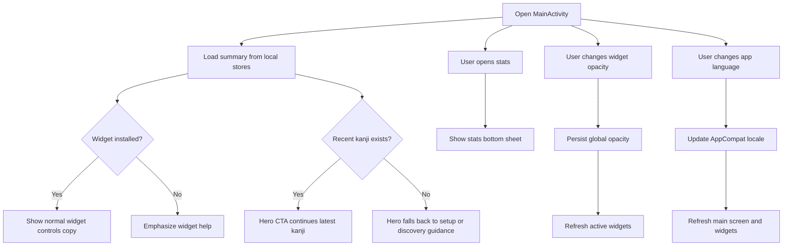

# Main Screen

## Purpose

Define the detailed design for the app main screen launched from the app icon.

This document covers:
- current behavior
- the current launcher design direction and its extension points

## Current State

Current implementation:
- `MainActivity` renders a lightweight launcher dashboard
- the app is still widget-first
- users are expected to interact mainly through the home screen widget and use the launcher as a summary or fallback surface

Current file:
- `app/src/main/java/com/example/kanjiwidget/MainActivity.kt`

## Design Goal

The main screen acts as a lightweight control center for the widget-based learning flow.

The screen should help users:
- understand what the app does
- install or use the widget
- continue learning from the latest kanji or a random kanji
- review today’s learning activity
- adjust a small set of widget appearance preferences

## Scope

In scope:
- define the structure and behavior of the main screen
- align the screen with existing widget and detail-screen features
- allow future integration with daily study statistics

Out of scope for the first version:
- user accounts
- remote sync
- advanced charts beyond the current lightweight bottom-sheet experience
- heavy onboarding flow

## Screen Role

The main screen should act as:
- an entry point for users who open the app from the launcher
- a fallback surface when widget interaction is not enough
- a summary screen for today’s study usage

## Proposed UI Structure

### 1. Hero Summary

The first slice of the refreshed main screen should merge the old header and today-summary areas into one stronger hero block.

Contents:
- app title
- short one-line description
- widget-installed status badge
- today summary with study time and open count
- one dominant primary CTA

Purpose:
- immediately explain that this is a widget-centered learning app
- make the first visible action feel obvious
- give today’s activity enough visual weight to justify opening the launcher

Behavior:
- the dominant CTA should represent the best next learning step for the current state
- if recent history exists, the primary CTA should continue the latest Kanji
- if recent history is missing, the hero should fall back to setup or discovery guidance instead of showing a dead primary action

### 2. Supporting Actions Section

Contents:
- short supporting guidance text
- `Open random Kanji`
- `View stats`

Purpose:
- keep secondary study actions accessible without competing with the hero CTA

Behavior:
- this section should no longer duplicate the dominant latest-study CTA from the hero
- random-kanji action uses the cached catalog and avoids the latest kanji when possible
- the stats action remains available from this section because it is a secondary exploration path

### 3. Recent Kanji Section

Contents:
- latest viewed kanji items
- each item opens the detail screen

Purpose:
- make the app usable as a lightweight review hub
- support quick re-entry into recent study history without competing with the hero CTA

First-slice direction:
- keep the bounded recent list directly on the screen
- improve row hierarchy so the Kanji and its metadata are easier to scan
- avoid promoting the first recent item as a second primary action when the hero already owns that role

### 4. Widget Controls Section

Contents:
- widget state summary text
- current widget background opacity value
- one tap action to cycle through supported opacity presets
- action to open widget setup instructions

Purpose:
- keep widget controls near the learning hub without turning the main screen into a full settings page
- support both installed-widget and missing-widget states in one place

First-slice direction:
- keep this section clearly secondary to study actions
- use shorter copy and stronger state-specific emphasis when the widget is missing

Current v1 behavior:
- opacity is global across all active widget instances
- the action cycles through preset levels rather than exposing a slider

### 5. Language Section

Contents:
- short description that language can follow the system or be overridden
- current app language label
- action to open the language picker

Purpose:
- allow quick language switching without adding a full settings screen
- keep the control lightweight and consistent with the widget-first launcher flow

First-slice direction:
- keep the section visually quieter than the learning-focused blocks above it
- preserve simple one-tap access without expanding into a full settings surface

Behavior:
- default selection is system language
- selection updates the app locale via AppCompat per-app language APIs
- changing language refreshes the launcher screen and active widgets

## User Flow

### Flow A: First app launch

1. User taps app icon
2. Hero explains the widget-centric concept and shows setup-oriented guidance
3. Main screen emphasizes how to add the home screen widget
4. User returns to the launcher and adds the widget

### Flow D: Adjust widget opacity

1. User opens app
2. User taps the widget opacity action
3. App cycles to the next supported opacity preset
4. Active widget instances rerender with the new background opacity

### Flow B: Returning user

1. User taps app icon
2. Hero shows today summary and the dominant next study action
3. User continues the latest kanji from the hero, or uses supporting actions for random study or stats

### Flow C: User without widget

1. User opens app
2. Main screen detects that no widget instance is currently active
3. Hero and widget-controls copy emphasize setup help over deeper exploration

## Main Interaction Diagram

## Behavior Rules

### Current version

The main screen should:
- stay lightweight
- avoid replacing the widget as the main learning surface
- not duplicate all detail-screen functionality
- present one clearly dominant study CTA instead of repeating the same action across multiple equal sections

### Empty state

If there is no recorded study data:
- keep the summary visible but supportive
- show setup guidance for the widget
- let the hero frame the next step as onboarding-lite instead of a dead continuation flow

### With data

If study data exists:
- show today summary inside the hero first
- prioritize one-tap continuation through the hero CTA
- keep recent-history and utility sections secondary in visual emphasis

### Widget opacity rule

The launcher exposes a lightweight widget opacity control.

Current behavior:
- store one shared default opacity value for the widget background surface
- support preset values `100%`, `85%`, `70%`, `55%`, and `40%`
- rerender active widget instances immediately after the value changes so widgets still using the shared default update in place

Reason:
- the main screen remains a lightweight shared-default control
- widget-specific overrides can now be introduced during placement without turning the main screen into a heavier settings surface

### Widget detection rule

The app should treat the widget as installed when at least one app widget instance exists for `KanjiAppWidgetProvider`.

Detection method:
- query `AppWidgetManager`
- resolve widget ids for `KanjiAppWidgetProvider`
- if the returned id list is not empty, widget-installed state is `true`
- otherwise widget-installed state is `false`

Behavior:
- if no widget instance exists, emphasize widget help content
- if at least one widget instance exists, show the normal launcher summary layout

## Navigation Design

Suggested destinations from the main screen:
- detail screen for the most recently viewed kanji
- a lightweight stats bottom sheet
- widget setup instructions

Navigation style:
- simple explicit buttons or cards
- no bottom navigation is needed

## Data Dependencies

Required local data:
- daily total study time
- daily open count
- latest viewed kanji
- optional recent kanji list
- current widget background opacity preset

Existing reusable source:
- `StudyTimeTracker` for today totals

Existing local storage:
- recent kanji history store
- widget appearance preferences

### Recent kanji history store

The main screen requires a concrete recency source.

Current local storage:
- `SharedPreferences`

Current responsibility:
- persist the latest opened kanji whenever `KanjiDetailActivity` starts
- keep enough data for the launcher to reopen the latest viewed Kanji

Current data:
- latest viewed kanji
- latest viewed timestamp
- bounded recent kanji list

Current keys:
- `latest_kanji`
- `latest_kanji_viewed_at`
- `recent_kanji_history_v2`

Current behavior:
- store the latest viewed kanji and timestamp for simple launcher access
- maintain a bounded recent list of the latest 10 unique kanji
- move a kanji to the top when it is opened again

### Widget appearance preferences

Current storage:
- `SharedPreferences` in the widget preference store

Current responsibility:
- persist one global widget background opacity value
- expose the current value to `MainActivity`
- let widget rendering read the same value when producing `RemoteViews`

## Technical Notes

Current implementation path:
- `MainActivity` is a layout-based activity
- summary fields are populated through a single repository-owned summary model
- keep business logic separate from the activity
- allow `MainActivity` to directly handle lightweight widget appearance preferences until a dedicated settings or repository layer is introduced

Primary files:
- `app/src/main/res/layout/activity_main.xml`
- `app/src/main/java/com/example/kanjiwidget/MainActivity.kt`
- `app/src/main/java/com/example/kanjiwidget/home/HomeSummaryRepository.kt`
- `app/src/main/java/com/example/kanjiwidget/history/RecentKanjiStore.kt`

### Data ownership

`HomeSummaryRepository` should be the single owner that assembles summary and recency data for the main screen.

Repository inputs:
- widget-installed state from `AppWidgetManager`
- today totals from `StudyTimeTracker`
- latest and recent kanji history from `RecentKanjiStore`
- cached kanji catalog from `KanjiWidgetPrefs` for the random-open action

Repository output:
- one main-screen summary model consumed by `MainActivity`

Current exception:
- widget appearance preferences such as global opacity are still read and written directly by `MainActivity`
- the random-kanji action currently reads the cached catalog directly from `KanjiWidgetPrefs`
- this is acceptable in v1 because the setting is small, local, and immediately followed by widget rerendering

Example summary fields:
- `isWidgetInstalled`
- `todayStudyMs`
- `todayOpenCount`
- `latestKanji`
- `latestViewedAt`
- `latestMeaning`
- `latestJlpt`
- `recentKanji`
- `showWidgetHelp`

### Study stats destination

The launcher stats action now has a concrete first-version target.

Current behavior:
- do not create a separate statistics screen
- open an in-app bottom sheet from the main screen
- support `7 ngày` and `30 ngày` chart ranges
- show chart summary values for the selected range
- show lightweight range insights including active study days and the current streak ending today
- show the latest opened kanji when available
- keep ranking inside the same bottom sheet

Fallback rule:
- if `latestKanji` is missing, hide that row in the stats bottom sheet
- keep chart and summary content available even when latest-history data is missing
- if the selected chart range has no study data, keep the sheet informative with empty-state summary copy instead of collapsing the content

Reasoning:
- this keeps the action useful
- it stays aligned with the current lightweight scope
- it avoids creating a full statistics screen too early
- it adds motivation-oriented feedback without turning the surface into a full analytics dashboard

## Edge Cases

### No widget installed

The app should still be usable and should explain how to add the widget.

### No tracked study data

The screen should not feel empty.
Use setup guidance and concise educational copy instead.

### No active widget instance

If the user changes opacity while no widget is active:
- keep the selected value
- apply it the next time a widget instance is added or refreshed

### Latest kanji missing

If recent-history data is unavailable:
- the hero should not present a broken continuation CTA
- supporting actions should still allow random study and stats access when valid
- keep summary and widget help visible

### Widget not installed but study data exists

If the user has study data but no current widget instance:
- still show today summary
- keep widget help visible near the bottom
- do not force the screen into a pure empty state

## Testing Notes

Manual test cases:
- open app on a fresh install and verify the empty state
- open app after using the detail screen and verify today summary is shown
- verify the hero shows one clearly dominant study CTA
- verify main-screen actions open the expected destinations
- verify the stats bottom sheet updates when the chart range changes
- verify the stats bottom sheet remains useful when there is no study data
- verify layout works on both narrow and tall devices
- change widget opacity and verify active widgets rerender

## Future Extensions

Potential future improvements:
- promote the launcher into a richer dashboard if the app grows beyond widget-first usage
