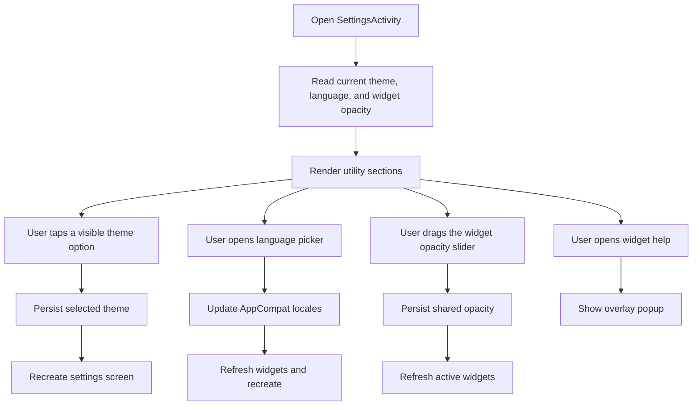

# Settings Screen

## Purpose

Define the first dedicated in-app settings screen that holds non-study controls previously embedded in the main screen.

## Scope

This screen owns:
- app theme selection
- app language selection
- shared widget opacity control
- widget setup help entry

This first slice does not add:
- account settings
- notifications
- ranking filters
- widget visual redesign on the actual home screen widget

## Design Goal

The settings screen should absorb low-frequency utility controls so the main screen can stay focused on study continuation and recent learning.

The screen should:
- feel visually consistent with the shipped theme system
- use a compact top bar with icon affordances instead of an oversized in-screen title block
- keep utility controls readable in `Light`, `Dark`, and `Glass`

## Proposed UI Structure

### 1. Header

Contents:
- one compact back affordance only

Behavior:
- do not repeat a large centered screen title when the current screen is already obvious from the content stack
- keep the screen title implicit and let the cards below carry the information architecture
- keep the top bar visually quiet instead of adding a second trailing action
- keep `Widget help` in the utility stack instead of duplicating it as a top-bar action

### 2. Widget Controls Section

Contents:
- widget state summary text
- one compact shared-opacity value readout
- one direct slider for the shared widget opacity
- one action to open widget setup instructions

Behavior:
- opacity remains global across active widget instances
- the slider supports the shared range from `40%` through `100%`
- keep the opacity label and value in one compact row instead of a large hero-style number
- widget help continues using the shared overlay popup system

### 3. Appearance Section

Contents:
- short explanation of theme behavior
- a two-row grid of visible theme tiles for `System`, `Light`, `Dark`, and `Glass`
- one small preview treatment per tile so the choices scan faster than plain buttons
- one compact section-link style meta label to show the fixed theme count

Behavior:
- `System`, `Light`, `Dark`, and `Glass` remain available
- changing theme recreates the current screen so all in-app surfaces update together
- this slice still applies theme changes only to in-app screens, not to home screen widget `RemoteViews`
- selected-state styling should be carried by the tile itself instead of a separate current-theme label block

### 4. Language Section

Contents:
- one list row with the current selected app language
- one list row for widget help

Behavior:
- default selection is system language
- changing language updates `AppCompat` per-app locales
- widget refresh behavior remains unchanged after language changes
- the language and help rows should live in the same utility stack as the widget-opacity control instead of becoming separate heavyweight cards

## Interaction Diagram

## Notes

- This slice changes the shared widget-opacity interaction from preset cycling to a direct slider while keeping the setting global across active widgets
- Shared popup styling should stay centralized so later settings additions do not reintroduce divergent dialog behavior
- The shipped first slice now uses a back-only top bar on `Settings`; `Widget help` remains reachable from the list row in the utility stack
- The canonical review artifact for this screen must preserve the same back-only top bar contract so the source doc and HTML screen spec do not drift
