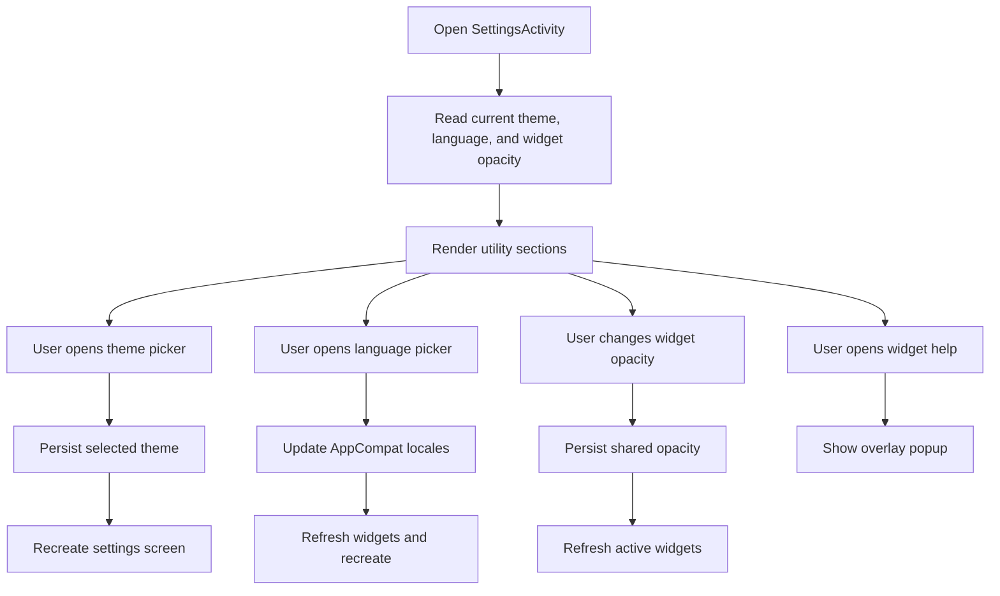

# Settings Screen

## Purpose

Define the first dedicated in-app settings screen that holds non-study controls previously embedded in the main screen.

## Scope

This screen owns:
- app theme selection
- app language selection
- shared widget opacity control
- widget setup help entry

This first slice does not add:
- account settings
- notifications
- ranking filters
- widget visual redesign on the actual home screen widget

## Design Goal

The settings screen should absorb low-frequency utility controls so the main screen can stay focused on study continuation and recent learning.

The screen should:
- feel visually consistent with the shipped theme system
- reuse the same popup overlay pattern already used for theme and language pickers
- keep utility controls readable in `Light`, `Dark`, and `Glass`

## Proposed UI Structure

### 1. Header

Contents:
- back affordance
- `Settings` title
- short subtitle explaining that theme, language, and widget controls live here

### 2. Widget Controls Section

Contents:
- widget state summary text
- current shared widget opacity value
- one action to cycle through supported opacity presets
- one action to open widget setup instructions

Behavior:
- opacity remains global across active widget instances
- supported preset levels remain `100%`, `85%`, `70%`, `55%`, and `40%`
- widget help continues using the shared overlay popup system

### 3. Appearance Section

Contents:
- short explanation of theme behavior
- current selected app theme label
- action to open the theme picker

Behavior:
- `System`, `Light`, `Dark`, and `Glass` remain available
- changing theme recreates the current screen so all in-app surfaces update together
- this slice still applies theme changes only to in-app screens, not to home screen widget `RemoteViews`

### 4. Language Section

Contents:
- short explanation of language behavior
- current selected app language label
- action to open the language picker

Behavior:
- default selection is system language
- changing language updates `AppCompat` per-app locales
- widget refresh behavior remains unchanged after language changes

## Interaction Diagram

## Notes

- The first slice prefers moving existing controls over redesigning their underlying behavior
- Shared popup styling should stay centralized so later settings additions do not reintroduce divergent dialog behavior
