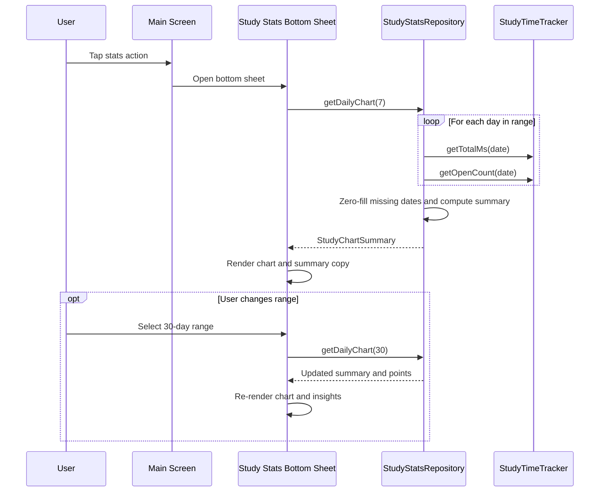

# Study Time Chart

## Purpose

Define the detailed design for showing study-time statistics as a time-based chart.

This feature visualizes the daily study-time data already recorded by the app.

Primary goals:
- help the user understand study consistency and recent activity trends over time
- surface lightweight insights that are easy to act on without turning the app into a heavy analytics dashboard

## Scope

In scope:
- display a chart based on daily study-time totals
- support multiple time ranges
- read local on-device data only
- integrate with the existing study-time tracking feature
- derive lightweight summary insights such as active study days and the current streak within the selected chart range
- provide a clearer no-data state inside the existing stats bottom sheet

Out of scope for the first version:
- cloud sync
- cross-device analytics
- comparison with other users
- highly interactive analytics dashboards
- a dedicated full-screen statistics destination

## User Value

This feature helps the user:
- see whether they are studying consistently
- identify low-activity and high-activity days
- understand short-term trends such as the past week or month
- quickly tell whether a recent study rhythm is forming

## Data Source

Primary source:
- `StudyTimeTracker`

Required metric:
- daily total study time in milliseconds

Current contract:
- `StudyTimeTracker` remains the owner of study-time storage
- it exposes explicit date-based read APIs for arbitrary `LocalDate` values
- `StudyStatsRepository` builds chart models on top of those public APIs

Chart v1 does not require:
- per-kanji time series
- open-count chart
- remote data

## Functional Definition

### Base metric

Each chart point represents:
- total detail-screen foreground study time for one calendar day

Unit:
- milliseconds in storage
- minutes and seconds in supporting labels

### Derived range insights

For the selected range, the stats summary should also derive:
- `activeDays`: number of days with recorded study time greater than zero
- `currentStreakDays`: number of consecutive days ending today with recorded study time greater than zero

Rules:
- `currentStreakDays` must be `0` if today has no recorded study time
- `currentStreakDays` must only count backward from today inside the selected chart range
- `activeDays` counts any non-zero day in the selected range, even if the days are not consecutive

Reason:
- these insights give the user clearer motivation and rhythm feedback than total time alone
- both metrics can be derived safely from the current local storage contract

### Time grouping

Grouping:
- one bar or point per local calendar day

Date basis:
- device local timezone

Missing days:
- must appear as zero-value entries inside the selected range

Reason:
- users should see continuity in the timeline
- a chart that skips missing days would distort study rhythm

## Supported Time Ranges

Recommended v1 ranges:
- last 7 days
- last 30 days

Optional future range:
- last 90 days

Default selection:
- last 7 days

Range definition:
- ranges are inclusive of today
- `last 7 days` means today plus the previous 6 calendar days
- `last 30 days` means today plus the previous 29 calendar days

Reason:
- simple and useful for first launch
- avoids overwhelming the user with too much historical data

## UI Behavior

### Placement

Recommended first integration:
- a chart section inside the existing main-screen stats surface

For v1:
- show the chart inside a bottom sheet launched from the main screen

Reason:
- it stays aligned with the current main-screen detail design
- it gives more vertical room than a simple alert dialog
- it avoids creating a full statistics screen too early

### Visual style

Recommended chart type:
- vertical bar chart

Reason:
- easiest to read for discrete daily values
- fits the app's lightweight local-stats model

Visual rules:
- x-axis shows day labels
- y-axis can be implicit or lightly labeled
- bars use the app accent color
- zero-value days remain visible as short or faint bars
- current day may be highlighted subtly

### Supporting text

The chart should be accompanied by summary text such as:
- total study time in selected range
- average daily study time in selected range
- best day in selected range
- active study days in the selected range
- current streak ending today

This keeps the screen useful even if the chart area is small.

Summary copy principle:
- the labels should make it obvious that the metrics belong to the currently selected chart range
- the text should stay lightweight and readable at a glance

## User Flow

### Flow A: Open chart from main screen

1. User opens the app main screen
2. User taps the main stats action
3. User sees a stats surface
4. User switches between `7 ngày` and `30 ngày`
5. Chart and summary insights update to reflect the selected range

Main-screen action rule for v1:
- rename the launcher action from `Xem thống kê hôm nay` to `Xem thống kê`
- reason: the chart surface is no longer limited to today-only data

### Flow B: No study data

1. User opens the stats surface
2. Selected range contains no recorded study time
3. The app shows an empty-state chart and supportive text
4. Range switching remains available so the user can still inspect `7 ngày` and `30 ngày`

## Main Interaction Diagram



## Data Flow

1. UI requests chart data for a selected range
2. Statistics repository requests daily totals for each date in the range
3. Repository fills missing dates with zero values
4. Repository computes derived summary insights for the same range
5. Repository returns ordered chart points from oldest to newest plus summary values
6. UI renders chart, summary values, and supportive empty-state text when needed

## Components

### Suggested repository

Suggested file:
- `app/src/main/java/com/example/kanjiwidget/stats/StudyStatsRepository.kt`

Responsibilities:
- read daily totals for arbitrary dates
- normalize a date range
- fill missing dates with zero values
- return ordered chart data
- compute summary metrics for the selected range
- compute active-day and current-streak insights for the selected range

### Suggested model

Current models:

```kotlin
data class StudyChartPoint(
    val date: LocalDate,
    val totalMs: Long,
    val openCount: Int,
)

data class StudyChartSummary(
    val points: List<StudyChartPoint>,
    val totalMs: Long,
    val averageMs: Long,
    val bestDay: StudyChartPoint?,
    val activeDays: Int,
    val currentStreakDays: Int,
)
```

### Suggested UI component

Possible files:
- `app/src/main/java/com/example/kanjiwidget/stats/StudyStatsBottomSheet.kt`
- or a reusable custom view for the chart area

## Storage Design

The chart reads existing data from the same local storage used by `StudyTimeTracker`.

Required read pattern:
- for each date in the selected range, read `study_total_YYYY-MM-DD`

The chart feature does not need new storage keys in v1.

Contract rule:
- `StudyStatsRepository` must not depend directly on undocumented private key names from unrelated UI code
- key naming must be treated as a shared storage contract owned by the stats layer

Current read APIs:

```kotlin
object StudyTimeTracker {
    fun getTotalMs(context: Context, date: LocalDate): Long
    fun getOpenCount(context: Context, date: LocalDate): Int
}
```

## API Design

Suggested repository API:

```kotlin
class StudyStatsRepository(private val context: Context) {
    fun getDailyChart(days: Int): StudyChartSummary
}
```

Rules:
- `days` must be positive
- results must always contain exactly `days` points
- points must be ordered from oldest to newest
- the last point in the list must always represent today
- derived summary metrics must be computed from the same ordered point list returned to the UI

## Empty State Design

If the selected range has no study time:
- render the chart with zero bars or a low-emphasis empty visualization
- show text such as `Chưa có dữ liệu học trong khoảng này`
- keep range switching available
- keep the summary area visible with zero-friendly or guidance-oriented copy instead of collapsing it

The screen should not collapse into a blank area.

Latest-kanji rule:
- if launcher summary data has no latest viewed Kanji, hide that row instead of showing an empty placeholder

## Edge Cases

### Missing dates

If storage has entries for some days but not others:
- generate explicit zero-value points for missing days

### Partial current day

The current day may still be in progress.

Behavior:
- include it as-is with current accumulated total
- let `currentStreakDays` reflect the currently stored value for today without prediction

### Timezone changes

If the device timezone changes:
- chart grouping follows current local date interpretation
- historical values remain tied to previously stored date keys

This may create minor inconsistencies across timezone changes, which is acceptable for local-only analytics.

### Very small values

If some days contain only a few seconds:
- chart rendering should still make those days visible
- supporting text should clarify real values
- any non-zero day still counts toward `activeDays` and may count toward `currentStreakDays`

## Technical Notes

### Rendering approach

Recommended v1 rendering:
- build a simple custom chart using standard Android views or `Canvas`

Reason:
- avoids adding a third-party chart dependency too early
- keeps APK size and maintenance cost lower

Alternative:
- add a chart library later if richer interactions become necessary

### Labels and density

To avoid crowding:
- show only key x-axis labels in the 30-day view
- show more frequent labels in the 7-day view
- do not require one visible text label per bar

### Summary calculations

For a selected range:
- total = sum of all point values
- average = total divided by number of days in range
- best day = point with maximum `totalMs`
- if all points are zero, `bestDay` must be `null`
- active days = count of points where `totalMs > 0`
- current streak = count of consecutive points from today backward where `totalMs > 0`

## Testing Notes

Manual test cases:
- verify 7-day range with mixed data and empty days
- verify 30-day range with sparse data
- verify empty state when no tracking data exists
- verify latest day updates after new study time is recorded
- verify switching ranges updates both chart and summary text
- verify active-day and current-streak insights for both selected ranges

Suggested unit tests:
- range generation with exact day count
- zero-fill behavior for missing dates
- ordered output from oldest to newest
- summary metric calculation
- active-day calculation
- current-streak calculation

## Future Extensions

Potential future improvements:
- add an alternate tab or mode that visualizes open-count trends
- add lightweight insight copy that reacts to stronger or weaker recent study consistency
