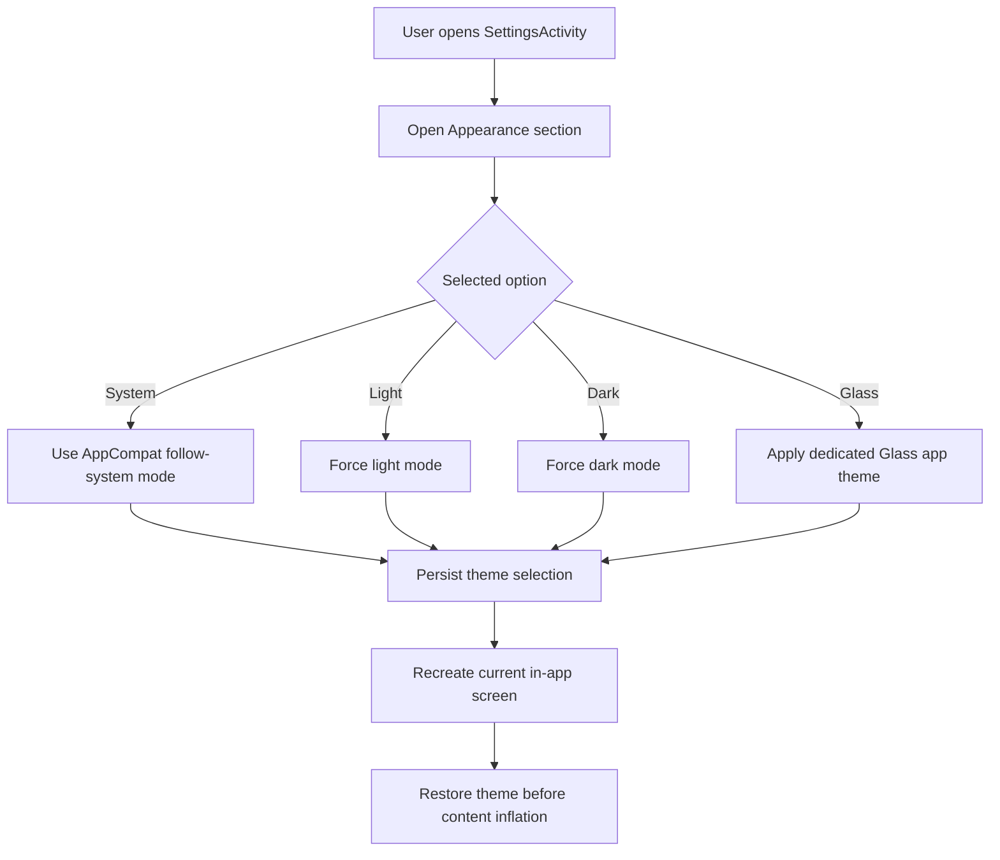

# Theme System

## Purpose

Define the first shipped app-wide theme system for `kanji-widget`, including persisted theme selection and the dedicated Glass visual mode.

This document covers:
- theme options and persistence
- where the selector lives in the app
- how the first Glass slice affects in-app screens
- motion rules and guardrails

## Scope

In scope:
- app theme options `System`, `Light`, `Dark`, and `Glass`
- persisted theme selection stored locally
- app-wide theme application for `MainActivity`, `KanjiDetailActivity`, `WidgetConfigurationActivity`, and the study-stats bottom sheet
- shared color and surface tokens for launcher, detail, and configuration screens
- lightweight entrance and list-item motion

Out of scope for the first slice:
- changing the actual home screen widget visuals
- per-widget theme selection
- theme-specific layout restructuring or navigation changes
- heavy blur pipelines, continuous animation, or performance-costly visual effects

## User Value

The first theme slice should let users:
- keep the app aligned with system appearance when they want a low-friction default
- force a stable light or dark mode when system following is not preferred
- switch to a more distinctive Glass presentation without losing readability or existing behavior

## Theme Options

### System

Behavior:
- follow the device light or dark setting through AppCompat day-night handling
- keep the app on the shared base theme tokens

### Light

Behavior:
- force the app into the light token set regardless of device mode

### Dark

Behavior:
- force the app into the dark token set regardless of device mode

### Glass

Behavior:
- use a dedicated app theme instead of only swapping light or dark colors
- keep the base layout structure, but restyle surfaces to look more layered and translucent
- reuse lightweight motion so the visual direction feels intentional without relying on platform blur APIs

## Settings-Screen Integration

The refreshed settings slice keeps theme controls inside `SettingsActivity` instead of presenting them on the launcher itself.

Placement:
- add a dedicated theme-selection card on `SettingsActivity`
- show a two-row tile grid for `System`, `Light`, `Dark`, and `Glass`
- give each tile a small preview treatment and let the selected state live on the tile itself
- keep the settings top bar quiet and route `Widget help` through the utility row instead of a second top-bar affordance

Reason:
- the launcher stays focused on study continuation and recent activity
- the settings screen already owns appearance and shared widget utility controls
- the tighter settings chrome keeps the theme selector visually closer to the approved canonical screen artifact

## UI Rules

### Shared surfaces

The theme system should expose reusable tokens for:
- screen background gradient
- hero surfaces
- standard cards
- inner panels
- button states
- accent and badge colors
- primary, secondary, and muted text

### Glass visual direction

The first Glass slice should:
- use brighter layered gradients behind the screen content
- use semi-translucent cards and panels with visible borders
- keep typography dark enough to remain readable on light translucent surfaces
- avoid relying on unsupported real blur effects so the design remains compatible with the current XML view stack

### Widget boundary

The home screen widget itself remains out of scope for the first theme slice.

Reason:
- widget rendering still depends on `RemoteViews`
- the same glass and motion system used by in-app activities cannot be reproduced safely there yet

## Motion Rules

The first slice should use short motion only:
- screen entry: fade plus slight upward settle
- dynamic row entry: short fade and lift for newly rendered recent-kanji and compound rows
- no long-running shimmer, parallax, or continuous motion

Reason:
- keep the app feeling more modern
- avoid adding a fragile animation layer around already shipped study behavior

## Storage Impact

Store the selected app theme in shared preferences alongside other local app settings.

Behavior:
- default to `System` when no selection exists
- restore the selected theme before activity content is inflated
- treat invalid or missing stored values as `System`

## Main Flow Diagram

## Testing Notes

Verify:
- each option persists after app restart
- Glass changes launcher, detail, stats, and configuration screens consistently
- language switching, random navigation, and widget configuration still behave normally after theme changes
