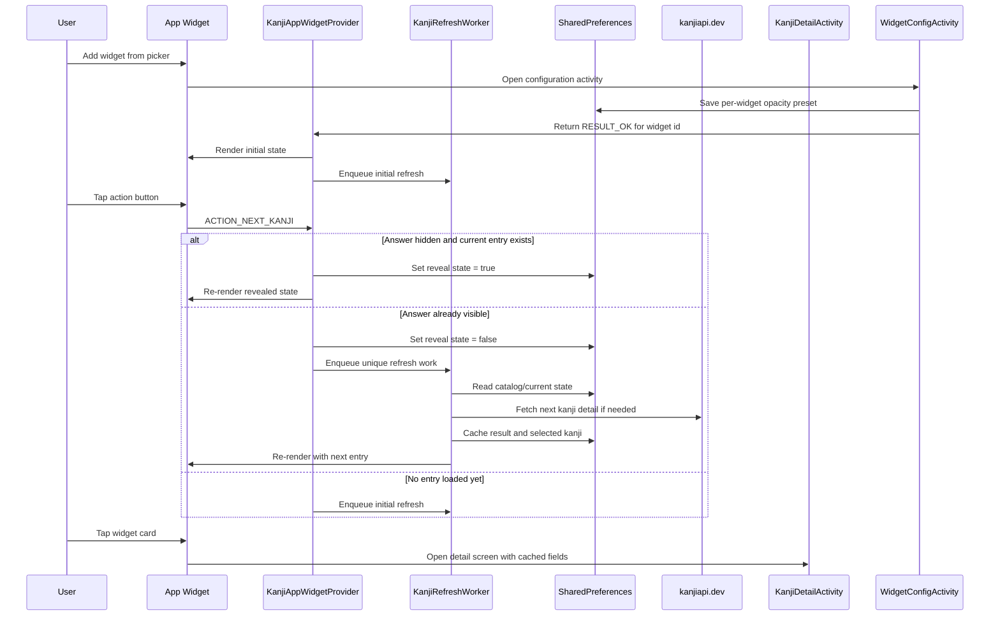

# Widget

## Purpose

Define the detailed design for the home screen widget experience.

This document covers:
- widget behavior
- update flow
- rendering logic
- interaction model
- data dependencies
- configuration flow

## Scope

In scope:
- app widget lifecycle handling
- Kanji loading and refresh behavior
- widget rendering rules
- widget-to-detail navigation
- adaptive layout behavior based on widget size
- lightweight configuration during widget placement

Out of scope for the first version:
- multiple widget themes
- offline bundled Kanji dataset
- autonomous rotation to a different Kanji without either a widget update event or explicit user interaction

Out of scope for the daily-rotation first slice:
- exact alarms or aggressive periodic scheduling to force a midnight widget refresh
- another widget-placement setting just to enable or disable daily rotation

## User Value

The widget provides:
- quick Kanji review directly from the Android home screen
- a lightweight reveal-and-next learning loop
- one-tap access to the richer detail screen

## Current Components

Primary files:
- `app/src/main/java/com/example/kanjiwidget/widget/KanjiAppWidgetProvider.kt`
- `app/src/main/java/com/example/kanjiwidget/widget/KanjiRefreshWorker.kt`
- `app/src/main/java/com/example/kanjiwidget/widget/KanjiWidgetPrefs.kt`
- `app/src/main/java/com/example/kanjiwidget/widget/KanjiApiClient.kt`
- `app/src/main/res/layout/widget_kanji_compact.xml`
- `app/src/main/res/layout/widget_kanji.xml`
- `app/src/main/res/layout/widget_kanji_expanded.xml`
- `app/src/main/res/xml/kanji_widget_info.xml`

## Functional Overview

### Widget learning loop

Current behavior:
1. Widget renders the current Kanji or a loading placeholder
2. User taps the action button
3. If the answer is hidden:
   - the widget reveals the reading and meaning
4. If the answer is already visible:
   - the widget switches to another random Kanji
5. User can tap the widget card to open the detail screen

### Widget placement configuration

First-slice behavior:
1. User adds the widget from the system widget picker
2. Android opens a lightweight configuration activity before placement completes
3. User chooses one background-opacity preset for that widget instance
4. The app stores the selected per-widget opacity, returns `RESULT_OK`, and triggers the normal first refresh flow

Purpose:
- give the user one meaningful setup choice at the right moment
- establish a durable entry point for future widget-specific customization
- avoid forcing the main screen to own all widget appearance setup

### Content shown in widget

Possible fields:
- Kanji
- JLPT level
- streak or completion badge
- state chip
- reading
- meaning
- example / metadata
- footer meta line
- action button

## Main Interaction Diagram

## Widget Lifecycle

### Initial placement or update

Trigger:
- `onUpdate`

Behavior:
- render immediately with whatever local data is available
- enqueue a refresh worker per widget instance

Reason:
- the widget should appear quickly even before network data is ready

Notes:
- `onUpdate` covers both first placement and later app-widget update callbacks from the provider configuration
- in the current implementation, these updates refresh data for the current widget instance but do not auto-advance to a different Kanji

### Placement configuration

Trigger:
- widget placement when Android passes a valid widget id into the configuration activity

Behavior:
- the activity should validate the widget id before saving
- the activity should default to the current shared opacity preset so existing behavior remains familiar
- completing the flow should persist a per-widget opacity value and finish with `RESULT_OK`
- cancelling the flow should finish with `RESULT_CANCELED` and should not create orphaned widget-specific state

Reason:
- Android widget configuration is the standard host-compatible entry point for per-widget setup
- the flow keeps the initial scope small while enabling future widget-specific controls

### Daily rotation first slice

Trigger:
- any widget render or refresh that happens after the local calendar day changes for a widget instance that already has a current Kanji

Behavior:
- the first slice is always on for all widget instances
- if the widget is revisited on a new local day, the next refresh should advance to a fresh Kanji before rendering the normal hidden-answer state
- if the widget is still on the same local day, the existing Kanji should remain until the normal reveal-and-next interaction advances it
- the first slice should reuse the existing host-driven update paths instead of introducing exact alarms, aggressive periodic work, or a persistent background service

Reason:
- daily freshness adds recurring study value without requiring the user to manage another option first
- the host-driven approach keeps the implementation compatible with Android widget limits and avoids a heavier scheduling contract in the first slice

### Resize

Trigger:
- `onAppWidgetOptionsChanged`

Behavior:
- rerender the widget
- recompute size class and text scaling

### Widget removal

Trigger:
- `onDeleted`

Behavior:
- clear any per-widget state stored for the removed widget id
- avoid handling later work for widget ids that are no longer active

Reason:
- widget-specific state is keyed by widget id in shared preferences
- cleanup prevents orphaned state from accumulating and reduces the risk of stale state being reused later

### Action button interaction

Trigger:
- broadcast action `ACTION_NEXT_KANJI`

Behavior:
- validate the widget id
- ensure the widget instance still exists
- decide whether to reveal or advance
- rerender immediately
- enqueue worker when a new Kanji must be loaded

Daily-rotation interaction note:
- if the local day has changed since the widget last loaded a Kanji, the widget may already have refreshed to a new hidden-answer entry before the next explicit button interaction

## Interaction Model

### Action button

Current labels:
- `Tải kanji`
- `Hiện đáp án`
- `Chữ tiếp theo`

State behavior:
- if no entry is loaded, the button loads data
- if answer is hidden, the button reveals the answer
- if answer is visible, the button advances to another random Kanji

### Card tap

Tap target:
- the main widget content area

Behavior:
- opens `KanjiDetailActivity`
- passes the current Kanji and cached detail fields if available

### Widget instances

Each widget instance keeps separate lightweight state:
- current Kanji
- reveal state
- current selected index from the most recent random pick

This allows multiple widget instances to coexist independently.

## Data Flow

### Catalog loading

Source:
- `kanjiapi.dev`

Behavior:
- worker fetches the Kanji catalog if not already cached
- catalog is stored locally in shared preferences

### Kanji detail loading

Behavior:
- worker chooses target Kanji
- fetches remote detail from API
- falls back to cached remote entry if available
- stores the result in local cache
- rerenders active widget instance

### Local persistence

Storage:
- `SharedPreferences`

Stored widget-related data includes:
- Kanji catalog
- current Kanji per widget
- reveal state per widget
- current selected index per widget
- background opacity per widget
- cached remote entry per Kanji
- one shared default widget background opacity value used as the fallback seed for new widgets and older instances

## Refresh Architecture

### Worker usage

Worker:
- `KanjiRefreshWorker`

Reason for worker-based refresh:
- network fetch should not block widget broadcast handling
- refresh can survive short-lived widget lifecycle boundaries

### Work policy

Current behavior:
- enqueue unique work using widget id
- replace any previous pending refresh for the same widget

Reason:
- avoid duplicated refresh requests
- keep the newest user action authoritative

### Network constraint

Refresh requires:
- connected network

If network data is unavailable:
- worker retries or falls back to cached entry when possible

### Periodic widget updates

Current configuration:
- the widget provider declares a periodic update interval in app-widget metadata
- each update rerenders immediately and enqueues a refresh worker for the same widget id

Design implication:
- widget content can become fresher without a tap from the user
- the reveal-and-next learning loop still only advances to a new Kanji when the user explicitly requests it

## Randomization Rules

Current selection model:
- pick a random Kanji index from the catalog
- avoid immediately repeating the current Kanji when possible

Reason:
- keeps the widget feeling dynamic
- avoids obvious repetition on back-to-back advances

## Adaptive Layout

The widget supports size-based presentation changes.

Current size classes:
- `COMPACT`
- `MEDIUM`
- `EXPANDED`

### Compact

Priority:
- top chips
- Kanji hero card
- short recall prompt
- action button

### Medium

Adds:
- meaning
- compact info card presentation

### Expanded

Adds:
- two-column composition
- reading card
- example card
- meta line

### Rendering rules

Adaptive behavior includes:
- different layout files per size class
- different font sizing per size class
- field visibility changes via `RemoteViews`

Reason:
- small widgets should remain glanceable
- larger widgets should use extra space meaningfully

### Current visual direction

The current widget presentation uses:
- a layered card surface rather than a plain stacked text list
- chip-style badges for JLPT and state
- a compact streak or completion badge that surfaces daily engagement without becoming a second widget panel
- a large hero panel for the Kanji itself
- state-aware accent surfaces for loading, hidden-answer, and revealed-answer states
- the same light blue, soft-stroke surface language now used across the refreshed main, detail, and stats screens
- compact and medium layouts that keep one clear study card first instead of splitting attention across too many equal blocks

Current implementation note after the UI refresh:
- `RemoteViews` still limits animation and blur, so the widget uses simplified gradients, opaque subcards, and state-aware button fills instead of trying to mirror the in-app Glass surfaces directly
- the compact widget now keeps a short reading prompt visible so the smallest size still feels like a deliberate study card rather than only a large kanji plus button
- the current shipped widget also surfaces streak or done-state feedback through the badge row rather than through a separate progress card

## Rendering Rules

### Placeholder state

When no detail entry is loaded:
- Kanji may show current cached character or `...`
- state chip shows a loading state
- hero and action surfaces switch to loading styling
- reading and meaning show guidance text
- button label becomes `Tải kanji`

### Hidden-answer state

When answer is hidden:
- state chip shows hidden-answer state
- widget prompts the user to recall reading and meaning
- example text is replaced with a hint to reveal

### Revealed-answer state

When answer is visible:
- state chip shows revealed-answer state
- action surface switches to the next-state accent
- reading and meaning are shown
- example / note field is shown if size class allows it

### Widget opacity

The widget supports a user-controlled background opacity setting.

Current behavior after the configuration first slice:
- opacity is applied only to the main widget background surface
- text and action surfaces stay fully opaque for readability
- a widget instance may use its own configured opacity preset
- existing widgets without a per-widget value should fall back to the shared default opacity safely
- supported presets are `100%`, `85%`, `70%`, `55%`, and `40%`

Reason:
- preserving opaque text and controls is more readable on busy wallpapers
- per-widget presets improve multi-widget flexibility without requiring freeform styling or a heavier settings surface

### Footer meta line

Current footer includes:
- random mode label
- catalog size when available
- source
- freshness if timestamp exists

## Navigation Contract

Destination:
- `KanjiDetailActivity`

Intent payload may include:
- Kanji
- source
- JLPT
- Onyomi
- Kunyomi
- meaning
- note

Reason:
- detail screen should open with meaningful content even before an additional fetch finishes

## State Model

Per-widget state:
- widget id
- current Kanji
- reveal flag
- current selected index recorded for the latest random selection

Shared cached state:
- Kanji catalog
- remote entries by Kanji

Shared appearance state:
- shared default widget background opacity
- optional per-widget background opacity override

## Constraints

### RemoteViews limitations

The widget uses `RemoteViews`, which limits:
- dynamic layouts
- custom view logic
- rich animation
- which view types and setter methods are safe across widget hosts

Design implication:
- keep widget interactions simple
- reserve richer UI for the detail screen
- prefer host-compatible primitives such as `ImageView`, `TextView`, and `Button` for dynamic styling

### Network dependence

The current widget depends on remote data for the Kanji catalog and details.

Design implication:
- first render should degrade gracefully
- cached entries remain important

## Edge Cases

### Invalid widget id

If a broadcast is received without a valid widget id:
- ignore the request

### Removed widget instance

If the user removes the widget but a broadcast still arrives:
- verify widget existence before handling
- do not recreate removed per-widget state
- widget deletion cleanup should already have removed persisted state for that widget id

### Empty catalog

If the catalog cannot be loaded:
- worker retries
- widget remains in a loading state

### New local day reached

If the widget is rendered after the local day changes:
- a widget with an existing current Kanji should refresh to a different Kanji when possible
- the refreshed widget should return to the hidden-answer state
- the first slice may wait for the next normal render or refresh opportunity instead of forcing a midnight alarm

### Single-item catalog

If the catalog has only one item:
- always return that item

### Missing remote entry

If detail fetch fails and cache is missing:
- worker retries

### Offline usage

If the user is offline after a Kanji was previously cached:
- widget can still show the cached entry for that Kanji

### Configuration canceled

If the user backs out of the configuration activity:
- placement should be canceled cleanly
- the app should not save partial widget state for that widget id

### Legacy widget without per-widget opacity

If an older widget instance exists from before the configuration slice:
- read the shared default opacity as a fallback
- keep rendering without forcing the user to recreate the widget

## Testing Notes

Manual test cases:
- add a new widget and verify the first refresh flow
- add a new widget and verify the configuration activity appears before placement completes
- choose a non-default opacity during configuration and verify only that widget uses it
- tap reveal and verify answer state changes
- tap next and verify a different Kanji is selected
- resize widget between small and large sizes
- tap widget body and verify detail screen opens
- test offline behavior after at least one Kanji has been cached
- place multiple widget instances and verify they behave independently
- change widget opacity from the main screen and verify all active widgets rerender
- verify a pre-existing widget without per-widget opacity still renders safely after the update
- verify widgets can still be added successfully after appearance customizations

Suggested unit or integration tests:
- random selection avoids immediate repeat
- size class resolution logic
- footer meta formatting
- preference read/write for per-widget state
- preference fallback from shared opacity to per-widget opacity
- cleanup removes per-widget state when a widget instance is deleted
- daily-rotation detection only advances after the local day changes
- daily rotation resets revealed state back to hidden when a fresh Kanji is loaded

## Future Extensions

Potential future improvements:
- theme selection
- scheduled daily rotation
- local bundled fallback dataset
- richer per-widget customization beyond opacity
