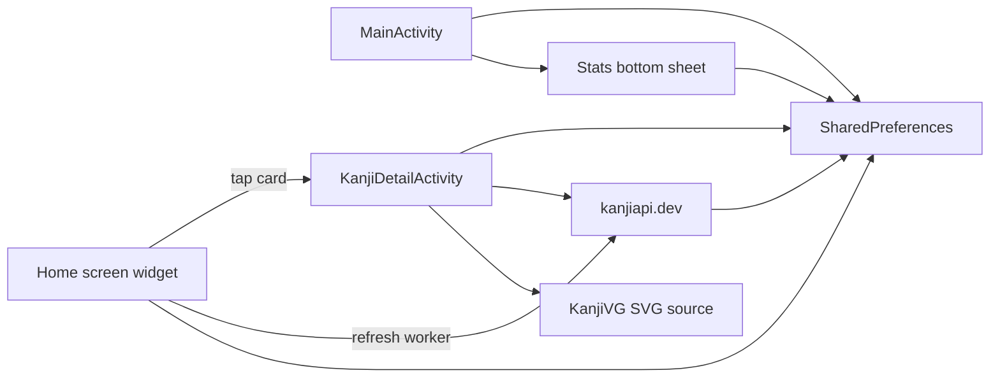
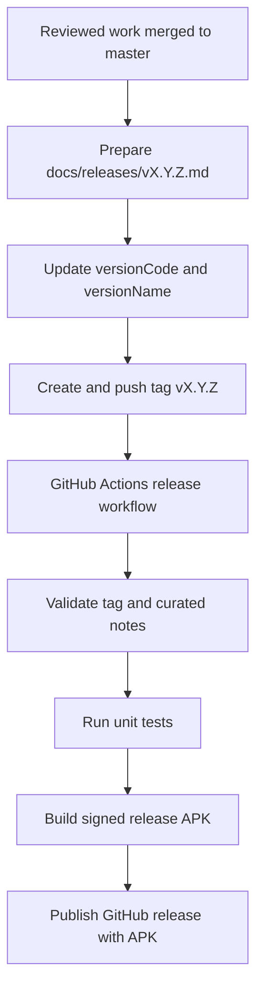

# Project Context

Last updated: 2026-03-13

## Goal

Build and maintain an Android app and home screen widget for lightweight Kanji review.

## Scope

- Android application and resizable home screen widget
- Kanji detail view with stroke-order playback
- Recent study history and daily study-time tracking
- Product and implementation design documents under `docs/`

## Constraints

- Kotlin + Gradle Kotlin DSL project
- External data sources include `kanjiapi.dev` and KanjiVG
- Keep repository documentation in English
- Keep design docs aligned with feature-level behavior changes

## Current Status

- Main app, widget flow, review-hub main screen, recent Kanji history, and study statistics are implemented
- `master` now includes the main-screen first-slice refresh with a stronger hero-first hierarchy, one dominant study CTA, lighter supporting actions, and clearer recent-history emphasis
- The lightweight stats-improvement slice is complete, including active-day insight, current-streak feedback, clearer range-aware summary copy, and a supportive no-data summary state in the existing stats bottom sheet
- The Kanji Detail screen now includes a lightweight compounds section with up to five filtered examples, each showing written form, reading, meaning, and a derived usage hint backed by local cache
- The Kanji Detail screen on `master` now includes on-device pronunciation playback for the main reading target and eligible compound rows using Android `TextToSpeech`
- `master` includes the Kanji Detail reading-availability fix from commit `69ca85e`, which keeps compound rows visible when readings are missing, treats placeholder-style readings as unavailable for playback, and has passing local unit coverage
- `master` now also keeps cached compound rows visible when readings are blank, so cached and freshly fetched detail behavior stay aligned
- Detailed design documents now exist for the major shipped features, including the Kanji Detail screen
- The repository has published tags through `v1.5.0`, including multilanguage support for EN + VI plus an in-app language picker plus the main-screen refresh and widget configuration first slice
- GitHub Actions workflows now cover debug APK builds and signed release builds
- The debug APK workflow now runs on pull requests and manual dispatch only, instead of every push to `master`
- The phased Kanji Detail screen update is complete, including layout, metadata, study stats, next-random navigation, and related design docs
- `master` now also includes direct unit coverage for widget selection, widget meta formatting, and widget-scoped preference cleanup through PR `#3`
- `master` now includes a widget configuration first slice: adding a widget opens a lightweight setup activity, new widgets can store per-widget opacity presets, and legacy widgets fall back safely to the shared default opacity
- `master` now also includes a host-driven widget daily-rotation first slice from PR `#7`, so widgets can advance to a fresh hidden-answer Kanji after the local day changes without introducing exact alarms or a persistent background service

## Runtime Diagram

## Release Flow Diagram

## Working Notes

- Use this file as the first stop for durable project context inside the repo
- Follow `docs/diagram-standards.md` when adding or revising durable design documents
- Add or update detailed design docs in `docs/detail-design/` when a feature changes materially
- Release signing remains secret-backed and must not be committed into the repository
- The release workflow expects `RELEASE_KEYSTORE_BASE64`, `RELEASE_STORE_PASSWORD`, `RELEASE_KEY_ALIAS`, and `RELEASE_KEY_PASSWORD` in GitHub Secrets
- Curated release notes live in `docs/releases/`, and the release workflow now expects a matching `docs/releases/<tag>.md` file when publishing a tagged release
- `docs/releases/<tag>.md` is the source of truth for what shipped in a tagged release, while release-tracked feature checklists only record `First released in` as a back-reference
- Internal tasks that do not affect shipped app behavior may use `First released in: \`n/a\`` instead of linking to a release tag
- Any machine-specific `android.aapt2FromMavenOverride` configuration should stay outside the repository so CI can use the default toolchain
- The Kanji Detail checklist remains useful as the implementation record for the completed phased update
- New complex tasks should start from `docs/checklists/TEMPLATE-complex-task-checklist.md`, while merged task checklists should be moved into `docs/checklists/archieved/` and later backfilled with `First released in` after the first tagged release ships
- `docs/checklists/technical-backlog.md` is the active short-list backlog for cross-session technical prioritization and should not be treated as a feature checklist to archive
- `docs/checklists/technical-backlog.md` should be updated whenever a backlog item is completed, superseded, or invalidated by newly shipped work so the next session inherits current priorities
- The current highest-priority technical backlog item is reviewing retention or compaction policy for long-lived local study-time storage after the widget daily-rotation first slice merged on `2026-03-13`
